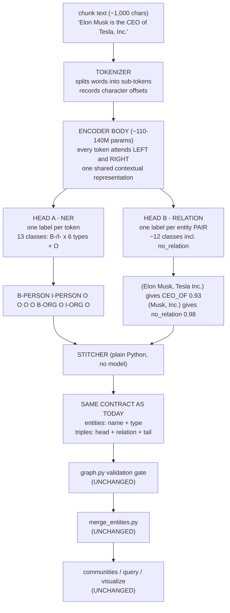
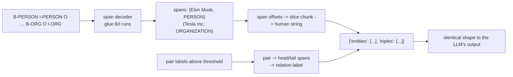
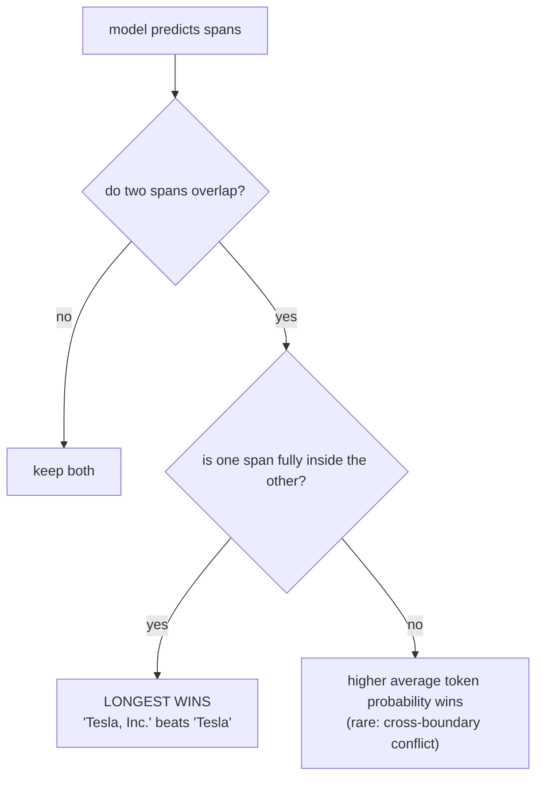
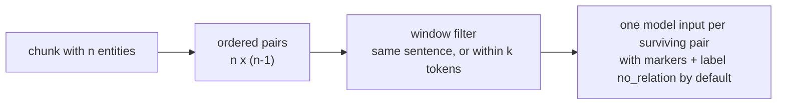
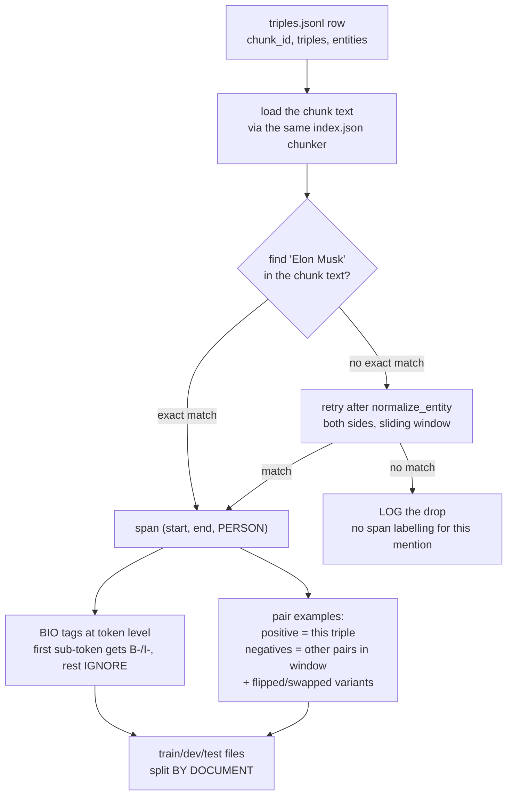
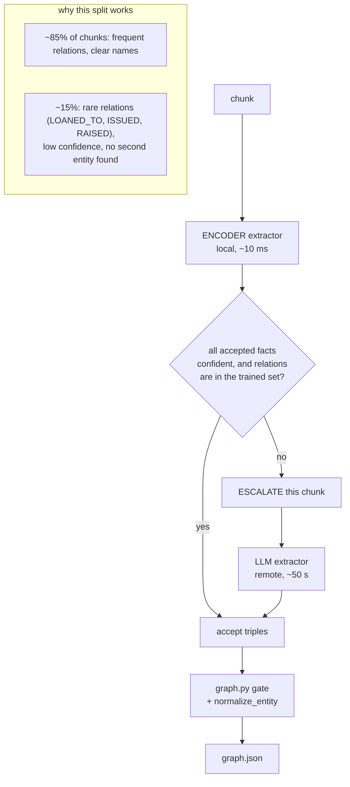
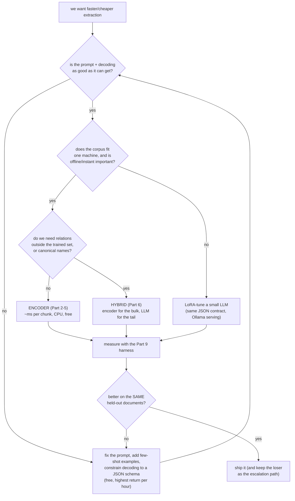
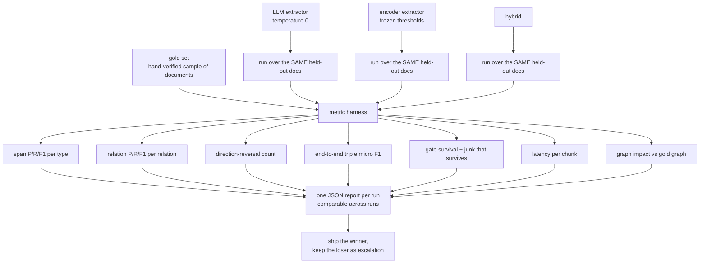

# Encoder Models for Extraction — Research Document

The extraction stage of this pipeline (`build_graph.py`) sends every chunk to a
prompted LLM and asks for `{"entities": [...], "triples": [...]}` back. That
works, costs one inference per chunk, and produces most of the noise this
project already fights downstream (inverted relations, vague entities, JSON
drift).

This document is the **alternative design**: replace the writer with a
*labeler* — a small encoder model (BERT / DeBERTa class, ~110–140M parameters)
that reads the chunk once and marks up the text it already contains.

Written as theory: ideas first, diagrams second, code never. Real examples from
this project's data throughout. Companion docs:
[architecture.md](architecture.md) (the whole system),
[graph_making.md](graph_making.md) (pipeline mechanics),
[solution.md](solution.md) (the entity-merging story),
[embed_research.md](embed_research.md) (the geometric layer).

**Nothing in this document is implemented yet.** It is the design space, the
trade-offs, and the recommended path — with every option priced honestly,
including the ones this project's zero-dependency rule makes expensive.

**The idea in one line:** an LLM *writes an answer* (slow, expensive, can be
wrong in structure); an encoder *highlights the text* (fast, local, cannot
invent structure) — and highlighting is enough for most of what this corpus
needs.

## Contents

| Part | Topic |
|---|---|
| 1 | Where "encoder" sits among model families |
| 2 | The architecture, box by box |
| 3 | BIO tagging in detail — the label format |
| 4 | Relation extraction in detail — the pair classifier |
| 5 | Where the training data comes from (silver → spans) |
| 6 | The hybrid architecture (the recommended end state) |
| 7 | The choices, with recommendations |
| 8 | Cost and hardware reality for this machine |
| 9 | How we would prove it works (evaluation design) |
| 10 | Honest limits |
| 11 | The summary |

---

## Part 1 — Where "encoder" sits among model families

### 1.1 Three families, one job

All three can turn a chunk into triples. They differ in *how* the answer is
produced, and that difference is everything.

```mermaid
flowchart TB
    subgraph DEC["DECODER-ONLY — what this project uses today"]
        D1["prompt: 'Extract entities and relationships...'"] --> D2["model generates JSON, token by token"]
        D2 --> D3["text is PARSED afterwards<br/>can fail: bad JSON, invented names"]
    end

    subgraph ENCDEC["ENCODER-DECODER — a middle path"]
        E1["input text"] --> E2["encoder reads, decoder generates<br/>a linearized triple string"]
        E2 --> E3["output is TEXT that is parsed<br/>(REBEL / T5 style)"]
    end

    subgraph ENC["ENCODER-ONLY — the subject of this document"]
        F1["input text"] --> F2["encoder reads once (bidirectional)"]
        F2 --> F3["classification heads score<br/>tokens and token-pairs"]
        F3 --> F4["labels are READ OFF, never generated<br/>structurally valid by construction"]
    end
```



| Family | Examples | How the answer appears | Failure mode |
|---|---|---|---|
| Decoder-only | `qwen2.5:3b-instruct` (our current backend), Llama, Gemini | Generated tokens → JSON text | Malformed JSON, invented entities, wrong direction, drifting format |
| Encoder–decoder | T5, BART (REBEL, GenIE-style) | Generated tokens → linearized triples | Same as above, but shorter outputs |
| **Encoder-only** | BERT, RoBERTa, **DeBERTa-v3**, **GLiNER**, SpanMarker | **Classification labels over input tokens** | Spans/relations wrong — but the *structure* is always valid |

The last row is the key property: an encoder cannot emit a token that is not in
its label set, and cannot emit a name that is not in the text. Its errors are
*choices among valid options*, never a broken document.

### 1.2 What the current stage actually costs

Facts from this repo, so the comparison is concrete:

| Fact | Value | Source |
|---|---|---|
| Corpus size | 49 articles, ~1,200 chunks | `data.py`, `data/index.json` |
| Chunks extracted so far | **43** | `data/triples.jsonl` |
| Graph built from them | 47 nodes, 67 edges | `data/graph.json` |
| Speed of the current extractor | ~50 s / chunk on the remote Ollama box | README (measured) |
| Therefore, full corpus | ≈ 16 hours, resumable | README (measured) |
| Output contract | `{"entities":[{"name","type"}], "triples":[{"head","relation","tail"}]}` | `build_graph.py` |

The last row is the only thing that must not change. Everything downstream —
the validation gate in `graph.py`, entity merging in `merge_entities.py`,
communities, query, visualization — consumes that JSON and does not care which
kind of model produced it.

### 1.3 The reframing: writer vs. labeler

```
WRITER (today)                          LABELER (this document)
──────────────────────────              ──────────────────────────
read chunk                              read chunk
think                                  
write '{'                               
write '"entities"'                          score every token: PERSON? ORG? neither?
write ':' ...  ~600 tokens generated        score every entity pair: CEO_OF? FOUNDED_BY?
parse it, hope it is valid JSON             keep labels above a threshold
~50 s, on a server                          ~10 ms, on this laptop
```

A labeler cannot produce "United States" if the chunk says "the US", and it
cannot clean "Tesla" into "Tesla, Inc.". Those are real losses — and they are
also exactly the two jobs this project *already* solved elsewhere:
`normalize_entity()` folds surface variants into one key, and
`merge_entities.py` decides identity. The pipeline was built expecting a noisy
namer; it turns out it is also built to receive a namer that never invents.

---

## Part 2 — The architecture, box by box

### 2.1 The whole model in one diagram



Two heads, one shared body. The heads are tiny (a linear layer each); all the
"reading" happens once in the body, which is why inference is cheap: the
expensive part is paid a single time per chunk, not per candidate fact.

### 2.2 The tokenizer: words become sub-tokens

Encoders do not see words, they see sub-token pieces. A 1,000-character chunk
of this corpus becomes roughly **200–260 sub-tokens** — comfortably inside
BERT's 512 limit, so `data.py`'s chunker needs no change.

```
"Tesla"        ->  [Tesla]                    1 piece
"Tesla, Inc."  ->  [Tesla] [,] [Inc] [.]      4 pieces  (punctuation separate)
"Eberhard"     ->  [Eber] [##hard]            2 pieces  (a word split in two)
```

Two consequences this design depends on:

1. **Offsets.** The tokenizer reports, for every sub-token, the character range
   it came from. That is how a span found in the text becomes a string, and how
   a string from `triples.jsonl` becomes a span. Never re-tokenize and guess —
   always carry offsets.
2. **Sub-token labeling rule.** A word split into `Eber` + `##hard` is *one*
   word: only the first piece gets the real label (`B-PERSON`), the continuation
   pieces get an **ignore** label (they contribute no loss). This is standard,
   and it is what keeps `Eberhard` from becoming two entities.

### 2.3 The encoder body: why bidirectional reading suits this task

A decoder reads left-to-right and therefore "knows" only the past. The encoder
reads the whole chunk at once, so every token's representation is built from
both directions:

```
        Elon   Musk   is   the   CEO   of   Tesla   ,   Inc   .
          ^      ^     ^    ^     ^    ^     ^      ^    ^    ^
          └──────┴─────┴────┴─────┴────┴─────┴──────┴────┴────┘
                every token sees every other token
```

Extraction is a *lookup* task, not a *generation* task (README principle #5:
"same input must give same output"). For lookups, seeing both sides is exactly
the right inductive bias: the relation between "Musk" and "Tesla, Inc." is
decided by the words *between* them ("is the CEO of") — words a causal model
must have already generated past before it can commit to a relation.

---

### 2.4 Head A — NER (token classification)

Each token gets one label from a small closed set: **B-** (begin) and **I-**
(inside) for each of this project's six entity types, plus **O** (outside).

```
Elon     Musk    is     the     CEO    of     Tesla ,    Inc .
B-PERSON I-PERSON O      O       O      O      B-ORG   O   I-ORG  O
└─── entity 1 ────┘                             └── entity 2 ──┘
```

Reading rule (the entire grammar): **an entity starts at every `B-`.** A `B-`
after `I-` means the previous entity ended. Glue consecutive `B/I` of the same
type → one name. Full treatment in Part 3.

The label set here is exactly `graph.py`'s `VALID_TYPES`
(`PERSON, ORGANIZATION, LOCATION, PRODUCT, EVENT, MISC`), so the encoder's
output feeds the existing type machinery — including `backfill_types()` —
with no translation layer.

### 2.5 Head B — relation classification

Two design facts drive this head:

1. **Relations live between *pairs*, not tokens.** So one input example is
   built *per candidate pair*, from the chunk text with the two entities
   marked in place:

   ```
   [CLS]  [H] Elon Musk [/H] is the CEO of [T] Tesla, Inc. [/T] .  [SEP]
              ^^^^^^^^^                        ^^^^^^^^^^^^
        the pair under judgement, in its own sentence
        ->  label: CEO_OF
   ```

   Marking the pair *inside its own context* is the single biggest accuracy
   trick in relation extraction: the model sees the words that actually express
   the relation, instead of two disconnected name strings.

2. **Direction is a label, not a rule.** `CEO_OF` and `HAS_CEO` are different
   classes; `FOUNDED_BY` and `FOUNDED` are different classes. This project's
   most documented extraction bug — inverted relations such as
   `SUBSIDIARY_OF -> Elon Musk` (see the `backfill_types()` comment in
   `graph.py` and README "Known limitations") — becomes a *decision boundary the
   model is trained on*, rather than a wording rule it must re-infer per chunk.

Every non-matching pair is labeled `no_relation`, which is what lets the head
say "these two entities are simply unrelated" instead of being forced to choose
a relation.

### 2.6 The stitcher: from labels to JSON

Plain Python. No model, no training, no ambiguity:



Responsibilities of this layer, and the only places it can be wrong:

| Step | What it does | Guard |
|---|---|---|
| Span decode | `B`+`I` runs → `(start, end, type)` | longest-span-wins when predictions overlap |
| Offset → string | slice the original chunk by character offsets | never re-tokenize (drift) |
| Pair decode | label above threshold → `(head, relation, tail)` | per-relation thresholds (Part 4.5) |
| Type normalization | types already match `VALID_TYPES` | no mapping table needed |
| Emit | the same JSON keys `build_graph.py` writes today | `valid_triple()` stays the referee |

### 2.7 Confidence, for free

Every label leaves the model as a probability, so each triple arrives with a
number:

```
(Elon Musk, CEO_OF, Tesla, Inc.)       0.93   <- accept
(Tesla, Inc., COMPETES_WITH, BYD)      0.61   <- keep, but worth watching
(Tesla, Inc., LOCATED_IN, California)  0.22   <- below threshold: escalate or drop
```

This project already scores trust *structurally*: mention counts ("real
relationships get re-extracted; junk appears once"), the mention-count filter in
`backfill_types()`, count-based pruning. An encoder promotes that implicit
confidence to an explicit one — the same ranking, available at extraction time
instead of only after aggregation.

---

## Part 3 — BIO tagging in detail

### 3.1 The three tags

| Tag | Meaning | Rule |
|---|---|---|
| `B-TYPE` | **B**egin — this token starts a new entity of `TYPE` | every entity starts here |
| `I-TYPE` | **I**nside — continues the entity that just started | only legal right after `B-TYPE`/`I-TYPE` of the same type |
| `O` | **O**utside — not part of any entity | default for ordinary words |

`TYPE` is one of this project's six: `PERSON`, `ORGANIZATION`, `LOCATION`,
`PRODUCT`, `EVENT`, `MISC`.

### 3.2 Why `I` exists at all

Because entity names are **multi-word**, and you must know where one ends:

```
Amazon    Web        Services
B-ORG     I-ORG      I-ORG        -> one entity: "Amazon Web Services"
```

Without `B` vs `I`, labels alone cannot distinguish *one* organization from
*three* separate mentions — and this corpus is full of multi-word names
(`Tesla, Inc.`, `United States–China trade war`, `World Trade Organization`,
`Jensen Huang`).

### 3.3 Two entities touching: the only rule you must remember

Two `B-` tags back to back mean two entities:

```
Martin       Eberhard   and   Marc        Tarpenning
B-PERSON     I-PERSON   O     B-PERSON    I-PERSON
└── entity 1 ────────┘        └── entity 2 ─────────┘
```

Compare with what `graph.py` does today: `add_triple()` has a
**compound-mention split** that detects `" and "` inside a name and replaces
`"Martin Eberhard and Marc Tarpenning"` with one edge per person, dropping the
compound. That is string surgery repairing a mistake the writer made. A BIO
labeler cannot make that mistake in the first place: two people are two `B-`
starts, and the stitcher emits two entities and (with the pair head) two
triples. The same guarantee covers `_VAGUE_RE` in `graph.py`: "other
automakers" carries no proper noun, so it has no span to label — a labeler
*structurally cannot* emit it, whereas the prompt has to explicitly forbid it.

### 3.4 Touching, nesting, and overlap — the precedence rules



Nesting is not hypothetical for this project: `graph.json` contains both
`tesla` and `tesla inc` as separate keys before merging, and
`merge_entities.py` exists precisely because of overlapping surface forms.
Deciding at label time (longest wins) still leaves the *identity* decision to
the merge stage, where it already belongs.

### 3.5 Failure cases, stated honestly

| Text | What a labeler does | Why it is the right behaviour here |
|---|---|---|
| "the company announced..." | no span (no proper noun) | matches `_VAGUE_RE` rejection of "company" |
| "the EV maker" | no span | the LLM would be tempted to name it "the EV maker" |
| "Musk" when the full name is "Elon Musk" | emits `Musk` | `normalize_entity` + merge resolves it |
| text says "the US", gold entity is "United States" | emits `the US` | surface form only; the merge layer owns canonical names |
| two people joined by "and" | two spans | the compound split becomes unnecessary |

The pattern: **everything an encoder gives up in flexibility, the existing
downstream layers already own.** The one thing it cannot give up is *coverage* —
it only sees text that is literally present.

---

## Part 4 — Relation extraction in detail

### 4.1 Step one: generate candidate pairs

The NER head finds entities; the relation head needs *pairs of them*. The
corpus decides how many:



Real arithmetic from this project's graph: the Tesla chunks average ~4–6
entities each, so `n=5` gives `5 x 4 = 20` ordered pairs per chunk. Across
~1,200 chunks that is roughly **24,000 pair examples**, of which the gold set
declares only a few thousand positive. That ratio *is* the training problem
(§4.4).

| Candidate strategy | Why choose it | Cost / risk |
|---|---|---|
| All ordered pairs in chunk | maximum recall | most negatives, slowest training/inference |
| **Same sentence only** | cheapest, most relations are sentence-local | misses relations stated across two sentences |
| **±k tokens window** (k≈50) | covers most cross-sentence cases in this corpus | a few more false candidates |
| Dependency/constituency filter | fewest candidates | needs an extra parser dependency; overkill here |

**Recommendation for this corpus:** sentence window, widened to ±50 tokens —
`data.py`'s chunker already packs whole paragraphs, and the relations in this
data ("X acquired Y", "Y is a subsidiary of Z") are almost always stated in one
sentence.

### 4.2 Step two: the label set

The label set is exactly the relation vocabulary this project already emits,
plus the rejection class:

```
no_relation        <- the default; most pairs land here
CEO_OF             FOUNDED_BY        LOCATED_IN
PARTNER_WITH       COMPETES_WITH     ACQUIRED
SUBSIDIARY_OF      EMPLOYS           INVESTED_IN
MANUFACTURES       ...
```

That vocabulary is *measured*, not invented. From `data/graph.json` today:

| Relation | Edges | Learnable from ~1,200 chunks? |
|---|---|---|
| `PARTNER_WITH` | 13 | yes |
| `LOCATED_IN` | 10 | yes |
| `COMPETES_WITH` | 7 | yes |
| `SUBSIDIARY_OF` | 6 | yes |
| `ACQUIRED` | 5 | yes, once the corpus is complete |
| `EMPLOYS` | 5 | yes |
| `CEO_OF` | 4 | yes |
| `FOUNDED_BY` | 3 | yes |
| `INVESTED_IN` | 3 | yes |
| `MANUFACTURES` | 2 | borderline |
| `ACQUIRED_BY`, `FOUNDING_MEMBER_OF`, `LOANED_TO`, `ISSUED`, `RAISED` | **1 each** | **no — structurally unlearnable** |

A classifier needs roughly **≥50 positive examples per class** to learn
anything stable. The top ~9 relations will get there after the full teacher run;
the singleton tail never will. Those five relations are not a training problem —
they are a *routing* problem, and Part 6 solves it by escalation.

Note the direction pairs in the vocabulary: `FOUNDED_BY` vs `FOUNDED`,
`ACQUIRED` vs `ACQUIRED_BY`, `SUBSIDIARY_OF` vs `PARENT_OF`. Today the prompt
lists only one direction of each and trusts the model to read the sentence
correctly — the source of the inversion bug. As classes, both directions can be
labeled explicitly, so "which way does this edge point" is *supervised*.

### 4.3 Step three: negatives are manufactured (and the best ones are free)

Labels come from `triples.jsonl`, so **positives** are free. **Negatives** must
be created, and one kind is uniquely valuable here:

```
Gold triple:        (Tesla, Inc.,  ACQUIRED,     SolarCity)          positive
Random pair:        (Elon Musk,   X,            Nas)                no_relation  (easy)
FLIPPED triple:     (SolarCity,   ACQUIRED,     Tesla, Inc.)        no_relation  (HARD)
SAME PAIR + WRONG
  DIRECTION LABEL:  (SolarCity,   ACQUIRED_BY,  Tesla, Inc.)        positive, different class
```

The flipped triple is the single most valuable training example this project can
generate, because it is exactly the error mode dominating the current graph
(`ACQUIRED_BY` appearing once while `ACQUIRED` appears five times; the
`backfill_types()` comment documents "small models frequently emit these
INVERTED"). Feeding the model gold positives *and* their own reversed form as
negatives teaches direction as a boundary instead of hoping a prompt enforces it.

| Negative source | Yield | Difficulty | Notes |
|---|---|---|---|
| Random entity pairs | huge | easy | keep only a small sample; they teach little alone |
| Same-sentence unrelated pairs | large | medium | realistic distractors |
| **Direction-flipped gold triples** | 1 per gold triple | **hard** | the inversion fix |
| Relation-swapped (right pair, wrong relation) | few per triple | hard | fixes `PARTNER_WITH` vs `INVESTED_IN` confusion |

### 4.4 Step four: the imbalance question

With ~24,000 pair examples and a few thousand positives, roughly **1 in 6–10**
labelled pairs is a real relation. Handle it with, in order of preference:

1. **Down-sample easy negatives** to about 3 negatives per positive — cheapest,
   and it keeps training fast.
2. **Never down-sample hard negatives** (flipped/swapped from §4.3) — they are
   the reason to train at all.
3. **Class weights** (or focal loss) for the rare *positive* relations, so
   `MANUFACTURES` is not swamped by `PARTNER_WITH`.
4. **Do not** optimize accuracy — with this ratio, predicting `no_relation`
   always already scores ~85–90%. Only per-class precision/recall/F1 and the
   end-to-end triple F1 (Part 9) mean anything.

### 4.5 Step five: thresholds instead of a global rule

The pair head returns probabilities, and each relation gets its own cut:

```
CEO_OF        >= 0.35    (recall-friendly: high-precision pattern, worth catching)
PARTNER_WITH  >= 0.55    (this corpus uses "partnered with" loosely)
COMPETES_WITH >= 0.60    (vague source vocabulary -> demand more confidence)
no_relation   win if it beats the best relation by a margin
```

Chosen by sweeping each relation's threshold on the dev split and reading the
precision/recall trade-off curve — the same style of measurement
`_measure_34.py` applies to evidence ranking. This knob simply does not exist
with a prompted LLM: there, precision/recall is whatever the wording produces.

### 4.6 What this head can never do

| Case | Why it fails | Where it is handled instead |
|---|---|---|
| Relation implied across two chunks | pairs are chunk-local | `merge_entities.py` + k-hop traversal in `query_graph.py` |
| Relation stated with no second entity in the same chunk | no pair to classify | escalation to the LLM (Part 6) |
| Rare relations (1–3 instances) | no training signal | escalation to the LLM |
| "Tesla" vs "Tesla, Inc." as the same company | surface-form only | `normalize_entity()` + merge |
| A fact that needs world knowledge ("Peak" is behind "Taycan") | no world knowledge in 140M params | LLM path, or accept the loss |

Every row is a **division of labour**, not a defect: the pipeline was already
built as a chain of specialists, and each of those specialists exists in this
repo today.

---

## Part 5 — Where the training data comes from (silver → spans)

### 5.1 The good news: the dataset already exists

`data/triples.jsonl` — the resumable checkpoint that `build_graph.py` writes —
is already a labelled dataset of the exact task:

```
input : chunk["text"]                         (from data.py's chunker)
label : {"entities": [...], "triples": [...]} (from the teacher LLM)
```

Label derivation for the encoder is *string matching*, not annotation:



### 5.2 The metric that decides everything: the drop rate

Some gold entities cannot be located in the chunk text — the teacher either
canonicalized them ("Tesla, Inc." while the chunk says "Tesla"), singularized
them, or **invented** them. Those mentions get no span label. Their share is the
**drop rate**, and it is the hard ceiling of this route:

```
drop rate 5%   -> encoder can reach ~95% recall at best
drop rate 30%  -> the LLM path stays necessary for a third of the facts
```

It is also a diagnostic of the *teacher*: mentions that cannot be found in the
text are precisely the hallucinated/vague ones `_VAGUE_RE` and the gate were
written to reject. So the drop rate is measured, logged per relation, and
reported next to every other metric in Part 9 — never silently absorbed.

### 5.3 How much data, honestly

| Corpus state | Chunks | Dataset | What it supports |
|---|---|---|---|
| Today (`triples.jsonl`) | **43** | ~43 chunks, ~150 entities | nothing trainable — a smoke test only |
| Full teacher run | ~1,200 | ~1,200 chunks, ~4–6k entity mentions, ~24k pairs | a real NER + RE model for the head relations |
| Full run + K samples/chunk at temperature > 0 | ~1,200 | same, with agreement scores per triple | the same, denoised (below) |

Two inexpensive amplifications, both reusing machinery in this repo:

1. **Self-consistency denoising.** Sample each chunk 3–5 times
   (`chat_json(..., temperature=0.7)`), canonicalize the triples with
   `normalize_entity`/`normalize_relation`, and keep only the ones present in
   ≥ half the samples. This attacks exactly the junk that "appears once →
   `mentions: 1`". Fewer, cleaner labels beat more noisy ones for a 140M model.
2. **Negatives from real text.** Chunks whose gold output is empty (the
   "Features:" sections of the TikTok article, "History:" headers) are valuable
   training rows: `entities: []`, `triples: []`. They teach the model to return
   nothing rather than fill the schema.

### 5.4 The split rule (do not get this wrong)

Split **by document, never by chunk**. `data.py`'s chunker adds **150 characters
of overlap** between neighbouring chunks, so two chunks from the same article
literally share text. A random chunk-level split would leak entities and
phrasings across the boundary and produce a dev score that is a fantasy. Reserve
whole articles (e.g. 5 of 49) as the frozen test set and never train on them —
and keep the same reservation for any LLM-vs-encoder comparison, so the numbers
are comparable.

---

## Part 6 — The hybrid architecture (the recommended end state)

### 6.1 The picture



### 6.2 Why this is the right final shape for *this* project

The pattern is not new here — it is README principle #2, already implemented
once:

| Layer | Cheap layer | Expensive layer |
|---|---|---|
| `merge_entities.py` (exists today) | blocking + Jaro-Winkler **nominate** candidates | the LLM **decides** merges |
| Extraction (this document) | the encoder **nominates** triples with confidence | the LLM **decides** the hard chunks |

Same philosophy, same audit trail (`merge_log.json` has a sibling here: the
escalation log), same honesty about who is allowed to decide.

### 6.3 What changes in the code (when the time comes)

One selector, nothing else:

```
build_graph.py   --extractor llm | encoder | hybrid      (default llm = today's behaviour)

encoder path     emits the same {"entities","triples"} JSON
hybrid path      encoder first, then LLM for escalated chunk ids, results merged

UNCHANGED        graph.py gate, merge_entities.py, communities.py,
                 query_graph.py, visualize.py, data/triples.jsonl checkpoint format
```

Because the checkpoint format is reused, escalation results and encoder results
land in the same file, and every downstream stage keeps working — including the
`chunk_id` provenance that makes answers citable.

---

## Part 7 — The choices, with recommendations

Everything below is a *decision*, not a detail. Each table states what the option
buys, what it costs, and what this project should pick.

### 7.1 The model

| Option | Size | Buys | Costs | Verdict |
|---|---|---|---|---|
| `bert-base-cased` | 110M | boring, fast, well-documented, CPU-friendly | ~2–4 F1 below the best | safe default |
| **`deberta-v3-base`** | 140M | best quality-per-parameter for NER + RE | needs `sentencepiece`; slower on CPU | **recommended default** |
| `distilbert-base` / MiniLM | 22–66M | fastest, smallest deploy | measurable accuracy loss on rare types | only if latency is critical |
| `bert-large` / `deberta-v3-large` | 340M+ | highest accuracy | 3× slower; overkill for 1,200 chunks | not worth it here |
| **GLiNER** | ~200M | entity *types as text prompts* → new types without retraining | a new dependency with its own conventions | the choice if type flexibility matters |
| SpanMarker | 110–400M | very strong NER, simple training | NER only (relations still need a second model) | use only for the NER half |
| REBEL / T5 (encoder–decoder) | 200M–1B | outputs triples as *text*, no span alignment needed | back to generation failures; needs its own label space | not this project |
| Train from scratch | — | nothing | an entire pretraining budget | never at this scale |

**Choice:** `deberta-v3-base` fine-tuned for both heads, with `bert-base-cased`
as the fallback if dependency pain or CPU latency gets in the way. Start from a
general-domain checkpoint; do **not** start from a biomedical/scientific one.

### 7.2 The architecture shape

| Option | Buys | Costs | Verdict |
|---|---|---|---|
| **Two-stage: NER → pair classifier** | simple, debuggable, each half measurable separately, standard tooling | span errors propagate into the pair stage | **recommended** |
| Multi-task single encoder (NER loss + RE loss together) | one model, shared training signal, faster | harder to debug; the two label sets fight for capacity | good second iteration |
| Joint span+relation (table-filling / global pointer) | no explicit pair enumeration, strong on nested cases | more custom code, less off-the-shelf help | skip |
| Span-based zero-shot (**GLiNER + GLiREL**) | promptable types/relations, no long training run | extra dependency; accuracy tuned for zero-shot, not for this domain | the pragmatic fast path |
| QA-style (ask "which organizations are in this text?") | reuses a reading-comprehension model | clumsy for relations; two questions per type | skip |

**Choice:** two-stage pipeline first. It matches how this project is already
built (one measurable stage at a time), and it produces two separate metric
boards — one for spans, one for relations — which is exactly the diagnostic
granularity this codebase prefers.

### 7.3 The tagging scheme

| Scheme | Tags | Buys | Costs | Verdict |
|---|---|---|---|---|
| IO | `I-`, `O` | fewest classes | cannot separate two adjacent entities of the same type | unusable here |
| **BIO (BIO1)** | `B-`, `I-`, `O` | the standard; every tool understands it | "inside" after "begin" slightly weaker near boundaries | **recommended** |
| BIOES / BILOU | adds `E-`/`S-` (end, single) | better span boundaries for long names | 4× label classes for a 6-type project; more data hungry | optional upgrade later |
| Span pointer networks | none (predicts start/end indices) | handles nesting naturally | custom loss and decoding; little library support | skip |

### 7.4 How the pair is presented to the model

| Option | Input | Buys | Costs | Verdict |
|---|---|---|---|---|
| **Typed entity markers** | `[H] Elon Musk [/H] ... [T] Tesla, Inc. [/T]`, with type tags | pair seen *in context*; best accuracy/effort ratio | a few extra special tokens | **recommended** |
| Text + `[SEP]` + head + `[SEP]` + tail | the two names appended after the text | trivial to implement | the model must learn to look back into the text | acceptable baseline |
| Pooled span vectors | `[CLS]`/mean over each span, concatenated | cheapest at inference | weak; ignores the words between the entities | avoid |

Note the nice side effect of markers: the *same* encoder template can serve both
heads, and the marker tokens give you an interpretable attention target when a
prediction looks wrong — a debugging surface a prompted LLM does not offer.

### 7.5 Negative sampling strategy

| Option | Buys | Costs | Verdict |
|---|---|---|---|
| **Easy negatives down-sampled to ~3:1 + all hard negatives** | fast training, direction learned | needs the hard-negative generator | **recommended** |
| Keep every pair, no sampling | no recall loss from sampling | ~24k examples, long epochs, extreme imbalance | only when compute is free |
| Focal loss / class weights over everything | handles imbalance without deleting data | extra hyperparameter tuning | combine with the above |

### 7.6 Threshold strategy

| Option | Buys | Costs | Verdict |
|---|---|---|---|
| **Per-relation thresholds tuned on dev** | precision/recall dial per relation | one more artifact to version | **recommended** |
| One global threshold | simplest | punishes rare relations and rewards dominant ones equally | fallback |
| `argmax` only (no threshold) | nothing to tune | forces a relation for every pair; `no_relation` class imbalance decides everything | never |

### 7.7 The dependency question (this project's zero-dependency rule)

This repo currently advertises **zero pip dependencies** (stdlib only). An
encoder breaks that, so the *deployment shape* is itself a choice:

| Option | Buys | Costs | Verdict |
|---|---|---|---|
| Install `torch` + `transformers` + `peft` into the main environment | simplest to run | ~2–3 GB of wheels; contradicts the README's promise; GPU wheels are heavier | only for training, in a separate environment |
| **Export to ONNX and run via `onnxruntime`** | main pipeline stays light; fast CPU inference; no torch at run time | an export step; some op-coverage fiddling | **recommended for serving** |
| Encoder extraction in its **own interpreter/venv**, communicating via the JSONL checkpoint | main pipeline keeps zero deps; encoder is an optional module | two environments to maintain; a subprocess call | **recommended for this repo's ethos** |
| Run the encoder as an HTTP service | any language could call it | back to a server to babysit — the thing we are trying to avoid | only at multi-user scale |
| Skip the encoder entirely and LoRA-tune the existing small LLM | reuses `llm_client.py`, Ollama serving, the whole existing stack | still a neural network on a per-chunk budget (~seconds, not ~ms) | the competing option — see 7.8 |

**Choice:** train in a throwaway GPU environment; serve as ONNX (or a separate
venv) so `python build_graph.py --extractor llm` keeps working with a stdlib-only
install. The encoder is an *optional module*, and the README's promise survives.

### 7.8 Which route should this project actually take?



The tree is deliberately ordered: **prompting fixes come before training, and
measurement gates everything.** Training a model to beat a baseline you never
measured is how projects end up slower *and* less accurate.

---

## Part 8 — Cost and hardware reality for this project

### 8.1 Side-by-side, using this repo's own numbers

| | Teacher LLM (today) | LoRA-tuned small LLM | **Encoder (this doc)** | Hybrid |
|---|---|---|---|---|
| Backend | remote Ollama / Gemini | local Ollama/vLLM | local CPU | both |
| Per chunk | ~50 s (measured) | ~1–3 s | ~10–60 ms (batched pairs) | encoder + ~15% of chunks at LLM speed |
| Full corpus (~1,200 chunks) | **~16 h** (measured) | ~20–60 min | **~1–3 min** | ~1–3 min + ~180 LLM calls (~2.5 h) |
| Runs offline | no | yes | **yes** | no |
| Fits this repo's stdlib rule | yes (HTTP only) | yes (HTTP only) | **no** — needs a model runtime | mixed |
| Hallucinates names | yes | less | **never** (spans only) | rarely |
| Confidence scores | no | no | **yes, per label** | yes |
| Deterministic | mostly | mostly | **yes** | no |
| Deployment size | server | ~2–4 GB model | **~110–440 MB** | both |

### 8.2 This machine specifically

Measured environment of the development box:

| Fact | Consequence |
|---|---|
| Windows, Python 3.10 | fine for the stdlib pipeline and for ONNX inference |
| **No CUDA GPU** (`nvidia-smi` absent) | **training must happen off-box** — Colab/Kaggle (free T4) or a rented GPU |
| `torch`/`transformers` not installed | training and (optionally) inference need a second environment |
| `llm_client.py` + `requests`-free stdlib HTTP | the current pipeline stays untouched while the encoder is developed separately |

The split is clean and worth stating plainly: **training is a one-off that can
live on a free notebook GPU; inference is a small CPU job that can live on this
laptop.** That combination is impossible with a 3B generative model and is the
main practical reason this route is attractive here.

### 8.3 What training actually costs

| Item | Value |
|---|---|
| Dataset | ~1,200 chunks → ~4–6k entity spans, ~24k pairs |
| Epochs | 5–10 (NER), 3–5 (relations) |
| GPU time | ~5–15 min on a free T4 for both heads |
| CPU-only training (worst case) | ~1–3 h — still a one-time cost |
| Re-training after new data | same cost again; the script is deterministic given a seed |
| Model artifacts | encoder weights (~440 MB fp32), tokenizer, thresholds JSON, label maps |

---

## Part 9 — How we would prove it works (evaluation design)

### 9.1 The harness



### 9.2 The metric board

| Metric | Definition | Why it matters here |
|---|---|---|
| **Span P/R/F1 per type** | offset-exact match of `(start, end, type)` | separates "missed the entity" from "got the relation wrong" |
| **Relation P/R/F1 per relation** | canonical `(head, relation, tail)` sets | the LLM baseline is only comparable per-relation |
| **Direction reversals** | same `(head, tail)` pair, opposite direction | this project's documented failure mode, counted explicitly |
| **End-to-end triple F1** | the same metric applied to both extractors | the *only* number that compares them fairly |
| **Drop rate** (Part 5.2) | gold mentions with no findable span | the structural ceiling of the encoder route |
| **Gate survival** | submitted vs accepted by `Graph.add_triple` | what the pipeline actually stores |
| **Junk that survived** | accepted triples not in gold | precision *after* the gate — the honest precision |
| **Latency per chunk** | wall time | the cost half of the trade |
| **Graph impact** | nodes, edges, average degree, top hubs vs gold graph | does the *graph* get better, not just the metrics |

Two rules make the comparison real:

1. **Same frozen test documents**, never trained on, for every extractor — this
   is why `merge_entities.py`-style auditability matters: the split is a file,
   not a habit.
2. **Report the ceiling next to the score.** Teacher-vs-teacher agreement on the
   same chunk (self-consistency) bounds what any student can achieve; without it,
   a score of 0.72 looks like failure when it may be near the maximum.

### 9.3 The test that decides, in the end

Extraction metrics are a proxy. The ground truth for this project is whether
`query_graph.py` still answers questions correctly — with citations — on a graph
built by the new extractor:

```
fixed question set (local + global):
  "Who is the CEO of Tesla?"
  "How is Elon Musk connected to SolarCity?"
  "What are the main themes of this dataset?"

for each extractor: rebuild graph.json -> run the question set
                    compare answers, citations, and the evidence subgraph
```

This mirrors `_measure_34.py`: measure the thing the user sees, not the thing
that is easiest to measure.

---

## Part 10 — Honest limits

| Limit | Consequence | Mitigation (or acceptance) |
|---|---|---|
| **Surface forms only** | "Tesla" stays "Tesla"; "Tesla, Inc." must come from the text | `normalize_entity()` + `merge_entities.py` already own identity |
| **Drop-rate ceiling** | gold mentions not present in the text cannot be learned | measure it; escalate those facts to the LLM |
| **No cross-chunk reasoning** | a relation split across two chunks is invisible | graph traversal + merge stage; or escalation |
| **Fixed relation set** | a new relation type requires relabeling + retraining | prompt the LLM for the tail relations, or freeze the vocabulary deliberately |
| **Long-tail relations** | 1–3-instance relations are unlearnable | route them to the LLM (Part 6) |
| **Inherits teacher noise** | distilling `triples.jsonl` copies whatever the teacher does *consistently* (an inversion that repeats becomes learned behaviour) | fix/de-noise the teacher first (Part 5.3), verify with the Part 9 harness |
| **Span errors propagate** | a wrong boundary becomes a wrong triple | measure span F1 separately from relation F1 |
| **512-token input limit** | if the chunker's target size is ever raised, tails of chunks are silently truncated | assert token length in the inference path; keep `data.py`'s ~1,000-char target |
| **No world knowledge** | cannot infer that "Peak" relates to "Taycan" | LLM path, or accept the loss |
| **Type ambiguity remains** | `ORGANIZATION` vs `MISC` on borderline mentions is a judgement call | the type-vote logic in `backfill_types()` still applies |
| **New dependency axis** | breaks the repo's zero-pip-dependency promise | serve via ONNX or a separate venv (Part 7.7) |
| **No labelled gold yet** | every number in Part 9 needs a hand-verified sample that does not exist today (43 chunks of silver) | make the sample before training — it is also the only way to know if training is worth it |
| **Domain lock-in** | trained on business/economy Wikipedia text; another domain needs re-evaluation | keep the LLM path as the generalist |

None of these is fatal; each is a *known* boundary of one stage, which is
precisely how the rest of this project is documented (`embed_research.md` has the
same section for embeddings).

---

## Part 11 — The summary

### 11.1 The division of labour, if this route is taken

| Layer | Owns | Status |
|---|---|---|
| `data.py` | fetching, cleaning, chunking, provenance IDs | exists |
| **encoder extractor** | **finding spans and deciding relations (fast, local, confident)** | *this document* |
| **stitcher** | **labels → the JSON contract** | *this document* |
| `build_graph.py` | orchestration, retries, resumable checkpoint | exists (gains an `--extractor` switch) |
| `graph.py` gate | validation, normalization, edge aggregation, type backfill | exists, unchanged |
| `merge_entities.py` | identity: "Tesla, Inc." / "Tesla" / "Tesla Motors, Inc." | exists, unchanged |
| `communities.py` | topics over the graph | exists, unchanged |
| `query_graph.py` | cited local/global answers | exists, unchanged |

### 11.2 The one-line summary

**An LLM writes an answer; an encoder highlights the text it was given.** The
highlighter is ~1,000× cheaper, runs offline on a laptop, emits confidence
scores, structurally cannot invent an entity or a malformed JSON — and it learns
this project's hardest extraction decision (which way a relation points) as a
label rather than hoping a prompt gets it right.

### 11.3 The path, if we do it

| Step | Deliverable | Prerequisite | Rough cost |
|---|---|---|---|
| E0 | finish the teacher run to ~1,200 chunks | `.env` backend (Gemini is ~10× faster) | hours, unattended |
| E1 | hand-verify ~40–60 chunks into a gold file; measure teacher self-consistency ceiling | E0 | an afternoon |
| E2 | span/pair dataset builder (silver → BIO + pairs, drop-rate report, doc-level split) | E1 | stdlib-only script |
| E3 | metric harness (the Part 9 board, `--self-test` proves it offline) | E1 | stdlib-only script |
| E4 | train NER + relation heads on a free notebook GPU | E2 | ~5–15 min compute |
| E5 | CPU inference + ONNX/venv packaging, `--extractor encoder` in `build_graph.py` | E4 | a day |
| E6 | head-to-head run: teacher vs encoder vs hybrid, then `query_graph.py` question set | E3, E5 | an afternoon |

### 11.4 When *not* to do this

- If the teacher's self-consistency is already low (E1), the ceiling is low too —
  fix the prompt and the teacher first; that work is free and benefits every
  route.
- If the encoder's end-to-end triple F1 lands below the prompted LLM on the same
  held-out documents, the honest move is the **hybrid**, not a rewrite.
- If keeping the "zero pip dependencies, stdlib only" property matters more than
  speed, then the LoRA-student route (same JSON contract, served over the
  existing Ollama/OpenAI HTTP path) is the better fit for the project's stated
  identity.

**Status: nothing described here is implemented.** The repo today contains 43
extracted chunks of silver data (`data/triples.jsonl`), a 47-node graph, and the
existing LLM extractor. This document is the design space — the architecture, the
ASCII and mermaid views, and every choice priced — so the decision to build it
can be made with numbers instead of enthusiasm.
