# GraphRAG Architecture — From Zero to Query

How this project turns plain text into a **knowledge graph** and then answers
questions from that graph.

This document is written as **theory**: ideas first, diagrams second, code
almost never. You do not need to read a single line of Python to follow it,
and you do not need to know anything about graphs, LLMs or search engines
before starting. Every example is real data produced by this pipeline.

> If you *do* want the mechanics, two companion docs go deeper:
> [graph_making.md](graph_making.md) — the build pipeline, stage by stage —
> and [solution.md](solution.md) — the entity-merging problem in full.

**The idea in one line:** ordinary RAG stores *what the text says*;
GraphRAG additionally stores *how the facts connect*. That structure is what
lets the system answer a question whose answer is spread across many
paragraphs — something no single chunk contains.

## Contents

| Part | Topic |
|---|---|
| 0 | The system at a glance |
| 1 | Nodes, edges and paths — the vocabulary |
| 2 | From text to graph — how a graph is formed |
| 3 | What is stored, and why it is stored as files |
| 4 | The naming problem — many names, one thing |
| 5 | Communities — compressing a graph into topics |
| 6 | Answering questions — two ways to search |
| 7 | The complete picture |
| A | Failure modes and their defences |
| B | Where to go next |

---

## Part 0 — The system at a glance

The whole machine has two halves:

- **Index time** — read the corpus once, extract its facts, clean up the
  names, group the graph into topics, and save everything to disk.
- **Query time** — answer a question using those saved structures.

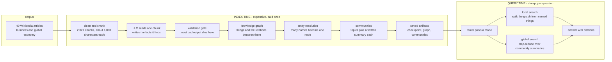

### Where the intelligence lives

The system calls an LLM in only **four kinds of places**, and that short
list explains its whole cost model:

| Job | When | Roughly how many calls |
|---|---|---|
| Read a chunk and list its facts | index time | one per chunk (about 2,000) — the expensive one |
| Judge whether two names mean the same thing | index time | one per small group of candidate names |
| Write a summary of one topic group | index time | one per community |
| Understand the question, then write the answer | query time | a few per question |

Everything else — chunking, validation, normalization, counting, ranking,
walking the graph — is plain deterministic code. Given the same inputs it
produces the same outputs, for free, forever.

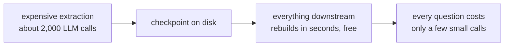

**The cost principle, in one sentence:** the only expensive call is paid
*once*, at index time, and written to disk — so per-question work stays
small, and improving any later stage costs no new extraction at all.

---

## Part 1 — Nodes, edges and paths: the vocabulary

### A node is a thing

A **node** is one distinct thing the text talks about — a person, a company,
a country, a product, an event. Examples from this corpus: *Tesla, Inc.*,
*Elon Musk*, *United States*, *Tesla Model 3*, *CHIPS and Science Act*.

Every node carries three useful pieces of information:

- **name** — how humans should see it (*Tesla, Inc.*)
- **identity** — a stable internal label that never changes, used by the
  machine to recognise the same thing across thousands of mentions
- **type** — person, organization, location, product, event, or "unclear"
- **mention count** — how many extracted facts touch it. This is a free
  importance signal: real, central things get mentioned again and again.

### An edge is a relationship

An **edge** connects two nodes and says *how* they relate. The natural shape
is a **triple** — head, relation, tail:

```
Elon Musk    --CEO_OF----->  Tesla, Inc.
Tesla, Inc.  --LOCATED_IN->  United States
Tesla, Inc.  --ACQUIRED--->  SolarCity
```

Every edge also remembers two things:

- **how often it was re-extracted** — a confidence signal. A relationship
  stated in five different articles is real; junk usually appears once.
- **which source chunks stated it** — provenance. This is what makes answers
  *citable* instead of a black box.

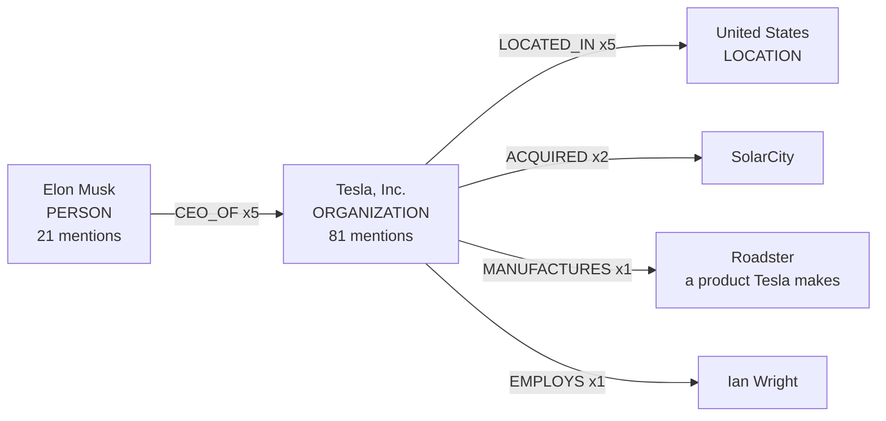

A node with its edges is often called a **hub**; a node with very few edges
is a **leaf**. Dense hubs like *Tesla, Inc.* are where the useful structure
lives.

### Paths are the point

Follow edges from node to node and you get a **path**. This is the single
most important idea in the whole project:

> A question like *"How is Elon Musk connected to SolarCity?"* has **no
> answer in any single chunk**. But the graph holds a path:
> `Elon Musk → CEO_OF → Tesla → ACQUIRED → SolarCity`.

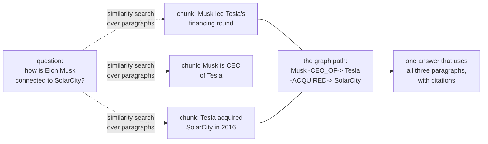

Two very different retrieval philosophies live in that picture:

| | similarity search | graph walk |
|---|---|---|
| finds | paragraphs that *look* like the question | things that are *connected* to the question |
| promise | "these passages are probably relevant" | "if a connection exists within N hops, it is in the evidence" |
| fails when | the answer is spread across documents | the connection was never extracted, or the names never merged |

That second row is why name handling (Part 4) matters so much: a graph whose
paths are broken by inconsistent naming silently loses answers.

---

## Part 2 — From text to graph: how a graph is formed

Five steps turn an article into structure:

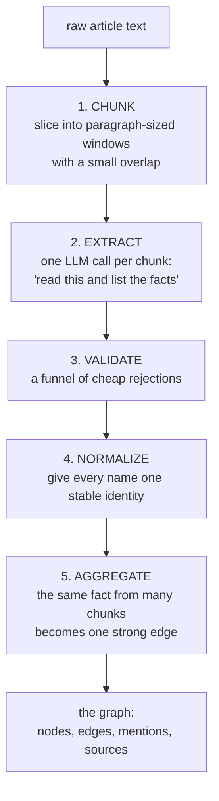

### Step 1 — chunking: why cut the text at all?

Two reasons, both practical:

1. **Attention.** A model asked to list the facts in 40,000 characters misses
   things. A model asked about 1,000 characters is precise.
2. **Granularity of provenance.** If facts were extracted per whole article,
   citations could only ever say "somewhere in this article". Per-chunk
   extraction gives every fact a home address.

The cutting is deliberately dumb and *repeatable*: paragraphs are packed into
windows of roughly 1,000 characters, and each window starts with a small
overlap from the previous one so a fact sitting on a boundary is not cut in
half. Because the rule is deterministic, re-running it on the same article
re-creates the exact same chunks — that is what allows an old citation to
still point at the right text months later.

Each chunk gets an identity of the form *article + position*, e.g. "chunk 9
of the Tesla article". Those identities are the citation addresses you see
inside answers.

### Step 2 — extraction: text becomes facts

Each chunk goes to the model with a narrow question: *what entities and
relationships does this text state?* The model answers with a small list of
triples and entity types. Nothing more is asked of it — no summaries, no
opinions.

Think of the model here as an extremely fast, extremely literal reader with
**amnesia**: it does not remember the previous chunk, has no idea what the
corpus is about, and will happily describe the same company differently in
two consecutive chunks. Everything after this step exists to survive that
amnesia.

Two decisions matter:

- **A hard cap on facts per chunk** (about 20). Without it, one rich chunk
  floods the graph and skews every later ranking.
- **A checkpoint written before the graph is touched.** Extraction is the
  only expensive step in the system, so its output is appended to a file
  immediately. Kill the process at any moment, restart, and it resumes where
  it stopped; chunks that fail permanently are remembered as failed so they
  are never paid for twice. That is what makes a many-hour build survivable.

### Step 3 — validation: model output is a suggestion, not data

Every proposed fact passes a **funnel of cheap rejections**. Nothing smart
happens here — it is all plain rules — and that is the point: rules are
free, instant, and identical on every run.

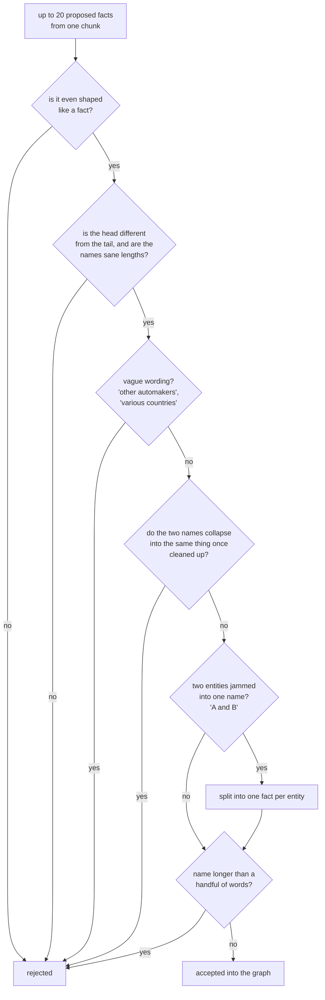

In plain words the funnel removes: malformed output, self-contradictions (a
thing related to itself), **vague groups** that name no identifiable thing
("other companies"), runaway names produced by a rambling model (something
like "tesla inc series b venture round of 13 million in february 2005"), and
compound mentions that hide two entities inside one name.

The rule for reading this funnel: it is a *filter*, not a fixer. Real garbage
that survived it sits in the current graph — a supposed `ACQUIRED` edge
pointing *from* the company *to* the person buying its shares, and a fact
claiming the company was the CEO of its own founder. Inverted triples are
grammatically fine, so a shape-check cannot catch them. This is why later
layers are suspicious by design and why final answers cite raw text instead
of asking you to trust the graph.

### Step 4 — normalization: one thing, one identity

Before an entity enters the graph, its name is converted into a **stable
identity**: lower-cased, accents removed, punctuation dropped, leading
articles removed, and trailing legal boilerplate (`Inc.`, `Corp.`, `Ltd.`,
`plc`, `GmbH`...) stripped. The human-readable name is kept separately, for
display.

```
"Tesla, Inc."   and   "Tesla Inc"   and   "tesla"   ->  one identity
"Volkswagen Group"  keeps the word "Group"          ->  a different identity
```

The list of stripped words is deliberately short, because trailing words can
*carry meaning*: "General Motors" is not "General", and a group is not the
same thing as the brand. This step is free, deterministic, and catches a
large share of duplicates immediately — but by design it cannot handle a
company that changed its name, or a person referred to by surname only. That
is Part 4's job.

### Step 5 — aggregation: many mentions become one fact

If five different chunks state the same relationship, the graph does not
store five edges. It stores **one edge with a count of five**, plus the list
of the five chunks that stated it.

That count is the cheapest quality signal in the system:

- relationships that are real get re-extracted from every article that
  discusses them → high counts
- hallucinated or one-off oddities appear once → count of one
- so a useful pruning rule comes for free: *ignore edges seen only once*

The same idea applies to nodes: a node's mention count is the number of facts
pointing at it, which is why *Tesla, Inc.* sits at 81 while most nodes sit at
1–3.

---

## Part 3 — What is stored, and why it is stored as files

### Two tables, one idea

Underneath the vocabulary, the graph is just two lookup tables.

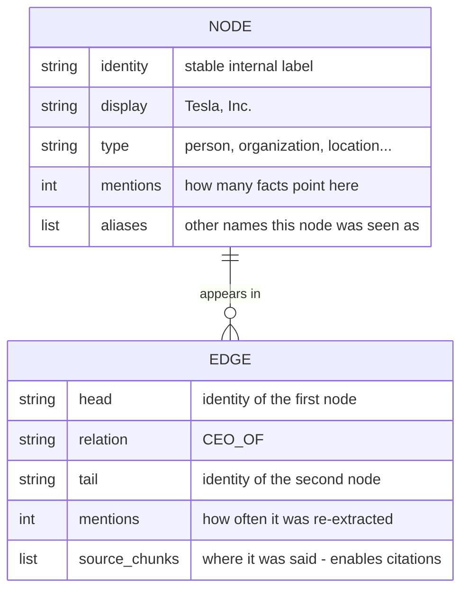

Everything else in this document is a consequence of those two tables:
search is a walk over the edge table, communities are groups of rows in the
node table, and an answer is a narration of the edges that were found.

### The artifact chain

Every stage of the pipeline leaves its result as a *file*, and each file is
derived from the one before it. Nothing is hidden in memory or in a server.

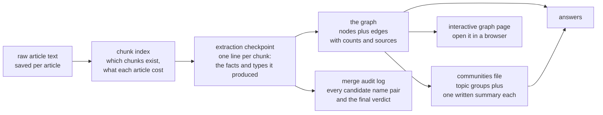

Read the arrows as *"can be rebuilt from"*:

- delete the graph file → rebuild it from the checkpoint in seconds
- tune the merge rules → rebuild the graph, no new extraction needed
- re-run clustering → new communities, still no new extraction needed
- delete the **checkpoint** → you pay the expensive extraction again

That is why the checkpoint (not the graph) is the precious artifact: it is
the only thing in the system that cannot be recomputed for free.

### Why plain files instead of a database

A real deployment would use a graph database. At this size — thousands of
facts, a graph file of a few hundred kilobytes — plain JSON is faster to
inspect, version and debug: you can open the graph, the merge log and the
community summaries in a text editor and see exactly what the system
believes. The swap to a database later is mechanical, because the shape of
the data (two tables above) is already the shape a graph store expects.

### Honest note on the shipped artifacts

The files in this repository come from different runs and are therefore not
perfectly in sync: the checkpoint currently holds a partial extraction (43
chunks) while the graph file already reflects a complete post-merge pass over
that partial data (47 nodes, 67 edges), and the communities file was computed
from *that* graph (2 communities, one of them a 45-node blob). This is by
design rather than an accident: each stage is independently re-runnable, so
partial states are normal, and the checkpoint remains the single source of
truth for everything downstream.

---

## Part 4 — The naming problem: many names, one thing

### The symptom

Extraction produced three separate nodes for one company — the same thing
described three ways in three different chunks:

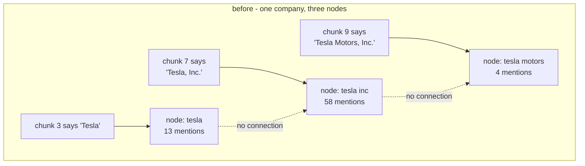

Three failure modes follow, and the third is the worst because it is
silent:

1. **Split evidence** — one node looks 4x more important than it really is,
   so every ranking and pruning decision is quietly wrong.
2. **Garbage topics** — later clustering puts the same company into several
   "different" topics.
3. **Traversal death** — a walk that starts at *tesla* never sees the edges
   stored under *tesla inc*. Paths simply stop, with no error message, and
   the missing answer looks like "the corpus does not say that".

### Why similarity alone cannot fix it

The tempting fix — merge names that look alike — breaks immediately, because
the deciding information is **world knowledge, not character overlap**:

| pair | similarity | correct verdict |
|---|---|---|
| `tesla` vs `tesla motors` | 0.73 | **merge** (former legal name) |
| `tesla` vs `tesla energy` | 0.73 | **do not merge** (a real division) |
| `tesla` vs `tesla powerwall` | 0.72 | **do not merge** (a product) |

Identical scores, opposite verdicts. Any threshold that merges the first row
also merges the other two, and a false merge is far more damaging than a
missed one: a split entity just costs some edge weight, while a false merge
poisons every future traversal that touches it.

So the design question is not "how similar are these strings" but **"do
these two names refer to the same real-world thing"** — a judgment call.
The architecture answers it with a funnel: cheap machinery narrows the field,
one informed judge decides, and plain code does all the bookkeeping.

### The funnel

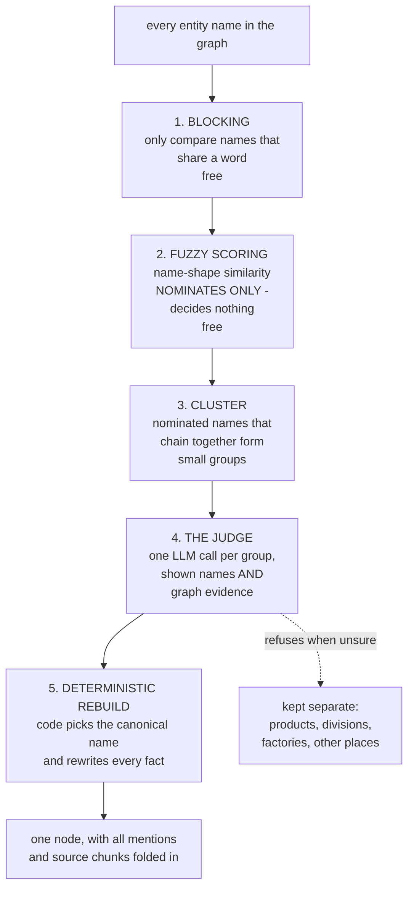

Numbers from a real sample run: **26** name pairs were nominated, they
clustered into **4** groups, and the judge saw **4** batches — four small
model calls, seconds of work, and the graph was clean.

### Guardrails set before the judge ever sees a pair

- Pairs containing "and" are skipped — those are compound artifacts that the
  validation funnel already split.
- Pairs joined by an explicit **maker → made** relationship (manufactures,
  launched, sells...) are skipped as *provably different things*. This single
  rule is what protects a product like *Tesla Powerwall* from being absorbed
  into the company that makes it, without spending a single LLM call.

### What the judge is shown — and why that is the whole trick

For each entity the prompt contains its **name, its type, how many mentions
it has, and a handful of its real edges**. So the judge does not see two
strings; it sees two *behavioural profiles*:

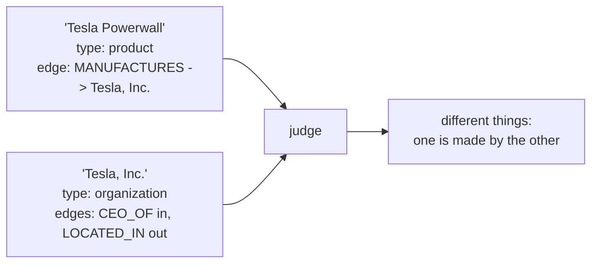

That is exactly the kind of reasoning that fails on strings and succeeds on
structure: a company has a CEO, employees, locations and acquisitions; a
product is manufactured or launched by someone. The prompt also states the
asymmetric rule out loud — *"missing a merge is a small error, a wrong merge
is a big error"* — so the model's bias matches the system's risk.

### Whose word is it? Code owns every decision that must be reproducible

The judge's answer is treated as a **suggestion**, like all model output:

- names it invents are ignored; groups of one are dropped; each entity may
  join at most one group
- the **canonical name is chosen by code**, not by the model — most mentions
  wins, ties broken by the longer, more complete name. In the sample run the
  winner was *Tesla, Inc.* (81 mentions) and the two variants became its
  aliases.
- the graph is then **rebuilt from the checkpoint** with the approved name
  mapping applied. Merging is therefore a pure re-derivation: change the
  rules, rebuild in seconds, pay nothing.
- every candidate pair, every verdict and every refusal is written to an
  **audit log** (26 nominations and 4 verdicts in the sample run), so a bad
  merge can always be found and traced back to the rule that allowed it.

### The result, honestly

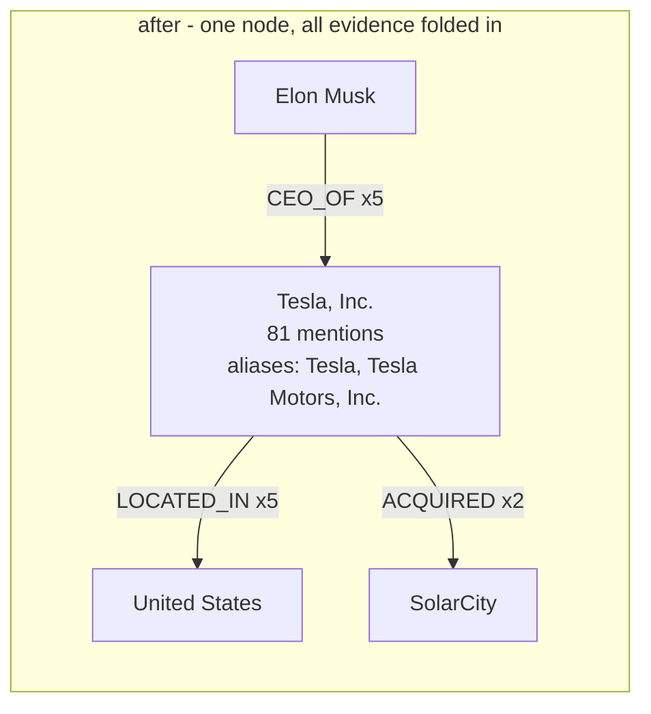

- merged correctly: the company variants, and a person named both fully and
  by surname
- **refused** correctly: the product line (Powerwall, Model 3, Roadster...) and
  two different gigafactories in two different countries
- **defensible but debatable**: a city and a location inside that city were
  merged; it was accepted and logged for review rather than hidden

The lesson that shaped the design is worth stating plainly: a *sycophantic*
judge with only names will happily merge "Gigafactory Texas" with
"Gigafactory Mexico" because the strings agree. Given types, counts and real
edges, the same model refuses. **Evidence beats similarity.**

---

## Part 5 — Communities: compressing a graph into topics

### The need

Some questions name nothing at all: *"What are the main themes of this
dataset?"*, *"Which companies are driving the AI race?"*, *"What are the
recurring patterns in these articles?"* The graph walk of Part 1 cannot
start, because there is no entity to start from — and the whole corpus (a few
hundred thousand words) cannot fit into one prompt.

Communities solve this by **compressing once, at index time**:

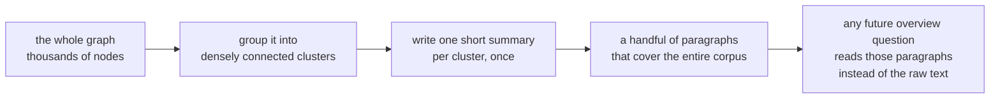

### Step 1 — forget direction, keep strength

Clustering ignores *how* two things relate and in which direction. Only one
question matters: which nodes are attached to which, and how strongly.

```
all relationships between Elon Musk and Tesla, in either direction
        ->  one undirected link, weight = 1 + log(total mentions)
```

The logarithm is not decoration. Without it, a single 80-mention hub outvotes
everyone around it and drags the whole graph into one giant blob. With it, a
hub is important but not deafening — the classic remedy for
**hub-swallowing**.

### Step 2 — clustering by label propagation

The algorithm is small enough to describe in four lines:

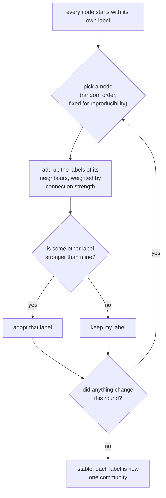

Why it works: inside a dense cluster, every node has many neighbours pushing
the same label, so the label reinforces itself. Bridges between clusters are
few and weak, so they carry too little voting weight to merge two clusters.
Labels stop changing quickly — usually within a handful of rounds.

### Step 3 — one summary per community

Each cluster is then handed to the model **once**: its key members and the
relations among them, in plain lines, with relations that cross into other
communities marked as borders. The result is a short paragraph — what this
group is about, who its key players are, how they relate. Tiny groups in the
sample were skipped, since summarising a two-node cluster costs the same as a
big one and teaches nothing.

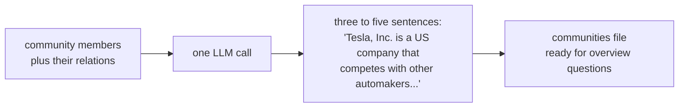

Everything here is reusable: a community summary is written **once** and can
answer unlimited future questions. This is the same cost trick as the
checkpoint — pay once, read forever.

### Honest note

Run on the small sample (a single article's worth of facts), clustering
produced **two** communities: one 45-node blob and one 2-node orphan. That
looks like a failure but is not — a one-topic corpus genuinely *has* one
topic, and a modularity score of about 0.04 confirms it. Real communities
appear once the full 49-article corpus makes the graph truly multi-topic.
The other lesson from that run is an ordering rule: **merge entities before
clustering**, because a company split into three nodes fragments what should
be a single community.

---

## Part 6 — Answering questions: two ways to search

Not every question is the same shape, so the system answers them with two
different searches. Choosing is itself a cheap decision.

### The router

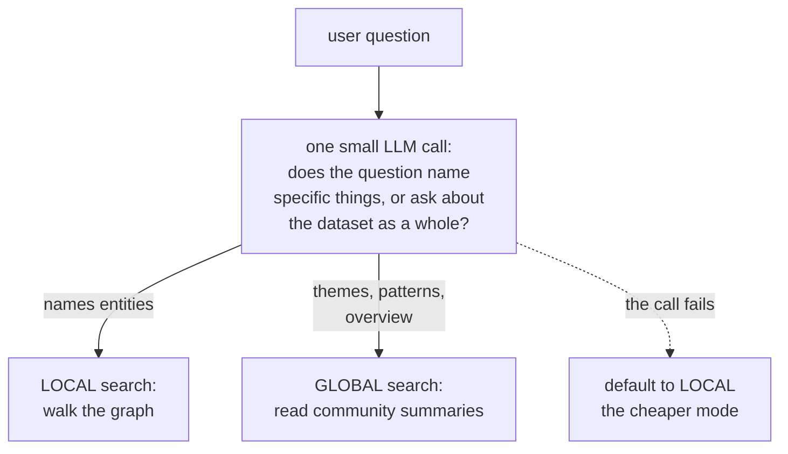

### Local search — questions that name things

*"How is Elon Musk connected to SolarCity?"*, *"Who is the CEO of Tesla?"*

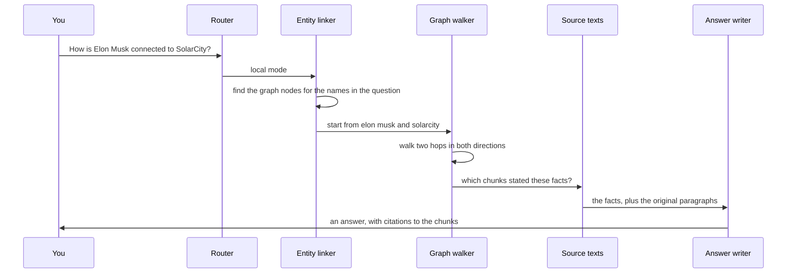

Four things are worth noticing, in plain theory:

1. **The question is turned into starting points, not into a search string.**
   A small model extracts the names in the question; those names are then
   matched to graph nodes — first exactly, then after cleaning, then by
   containment — and where several candidates match, the most-mentioned one
   wins.
2. **The walk is the retrieval.** Two hops out from every starting point, in
   both directions, then everything those hops touched. This gives the
   headline guarantee: *if a connection exists within the allowed number of
   hops, the evidence contains it.* No similarity search can promise that,
   because similarity has no notion of "two hops away".
3. **Evidence is ranked and capped** before it is shown to the model: facts
   that touch a starting point come first, then facts supported by the most
   source chunks. A cap keeps the prompt small.
4. **The model's job shrinks.** It no longer has to *find* the connection; it
   only has to *narrate* one that was already found — using the supplied
   facts and paragraphs, and citing them:

```
A: Elon Musk is connected to SolarCity through Tesla's acquisition of
   SolarCity in 2016... [Tesla chunk 9] [Tesla chunk 15]
```

Citations are not cosmetic. They are what lets a human verify a claim in
seconds, and what keeps an inverted or stale edge from silently becoming an
unverifiable assertion.

### Global search — questions about everything

*"What are the main themes?"*, *"What patterns show up across these
companies?"*

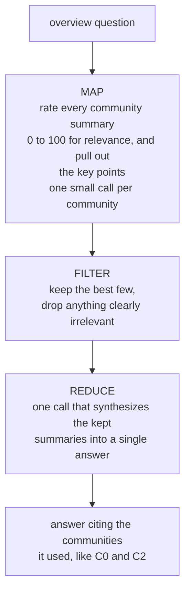

Why this is cheap: the candidate pool is *communities*, not chunks — a
handful of paragraphs instead of thousands of raw ones — and every candidate
was already compressed once at index time. The map step is embarrassingly
parallel and individually tiny.

Notice the shape of the two search modes:

| | local | global |
|---|---|---|
| starts from | names in the question | the whole dataset |
| reads | graph edges plus the original paragraphs behind them | pre-written community summaries |
| produced at | query time, per question | index time, once |
| cites | source chunks | community ids |
| good for | "how are X and Y connected?" | "what is this corpus about?" |

### When things fail, the system says so

Every layer is allowed to fail *loudly and partially* rather than silently
and completely:

| what fails | what happens |
|---|---|
| the router call | the system falls back to local search, the cheaper mode |
| no entity in the question matches the graph | it says so, and suggests the global mode instead of inventing an answer |
| one community fails to be rated | that community is skipped; the rest still answer |
| the evidence does not contain the answer | the model is instructed to reply exactly that — and citations make the claim checkable |
| the expensive extraction is interrupted | restart the build; finished chunks are read back from the checkpoint |

This is a design stance, not a nicety: in a system built on probabilistic
components, the honest failure is a feature.

---

## Part 7 — The complete picture

One diagram, both halves of the machine, with the only expensive step
confined to the top row:

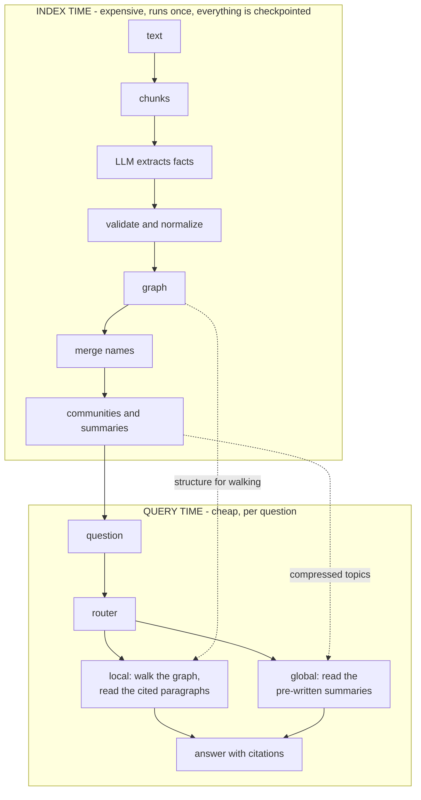

### The seven rules that hold it together

1. **Model output is a suggestion, not data.** Every stage validates,
   normalizes, caps and logs before it trusts anything.
2. **Cheap layers nominate; expensive layers decide.** Blocking and fuzzy
   scoring find candidates for free; the model only judges candidates. Neither
   does the other's job.
3. **Give the judge evidence, not just names.** Types, mention counts and
   real edges are what turn a string-matcher into a decision-maker.
4. **The graph stores structure; the text stays retrievable.** Every edge
   remembers its chunks, so every answer can be cited and checked.
5. **Mention counts are free confidence.** Real relationships are stated
   again and again; noise appears once.
6. **Checkpoint the expensive step.** Extraction is paid once; every
   downstream stage is a free re-derivation from it.
7. **Over-merging is worse than under-merging.** A split entity costs some
   edge weight; a false merge poisons every future traversal. Every threshold
   and every prompt rule leans toward "do not merge".

### What each layer is for — the deletion test

A good way to understand a component is to imagine removing it.

| remove this | what breaks |
|---|---|
| chunking | citations become vague ("somewhere in this article") and extraction quality drops |
| the extraction step | there is no graph — you are back to plain text search |
| the validation funnel | the graph fills with vague groups, self-loops and rambling names |
| the checkpoint | every rerun costs the full price of extraction again |
| entity merging | paths break silently; the same thing looks like three unrelated things |
| mention counts | nothing can be ranked, pruned or trusted |
| communities | overview questions become impossible without feeding the whole corpus into one prompt |
| the router | you must know the right mode yourself every time |

---

## Appendix A — Failure modes and their defences

Everything that has actually gone wrong in this project, stated as theory:

| failure | why it happens | defence in the design |
|---|---|---|
| **Fragmentation** — one company becomes three nodes | the reader-model never names anything twice the same way | the merge funnel (Part 4) + conservative key cleaning (Part 2) |
| **Silent traversal death** — paths stop for no visible reason | edges live under a node name the walk never visits | merging before search, plus linking that tries exact, cleaned and containment matches |
| **Inverted facts** — a company "acquired" its own investor | models swap head and tail, and the result is still grammatically valid | shape-checks cannot catch it, so: mention-count ranking, edge evidence for the judge, and citations in every answer |
| **Vague mentions** — "other automakers" as a node | models summarise instead of naming | the vagueness filter at the gate — with honest residue: a few still survive older builds |
| **Compound mentions** — two people in one name | models join lists with "and" | the gate splits them into one fact per part |
| **Hub swallowing** — one giant cluster, no topics | a very high-mention hub dominates every vote | clustering weights use a log scale, so a hub is loud but not deafening |
| **Hallucinated relationships** | models occasionally state facts that are not in the text | one-off facts are down-ranked and can be pruned by mention count; answers cite the source |
| **Cost and interruption** | extraction is one call per chunk, sometimes for hours | the checkpoint makes the run resumable, and permanently failed chunks are never retried blindly |
| **Wrong merge** | two similar-looking names are actually different things | asymmetric prompt bias, maker-to-made guardrails, code-chosen canonical names, and an audit log of every verdict |
| **No semantic matching** | linking is name-based, so "the EV maker" finds nothing | a known limit, not a bug: semantic linking needs embeddings, and is the natural next version |
| **A single-topic corpus** | clustering "fails" to find several topics | that is the correct answer for one topic; the metric confirms it rather than hiding it |

Two meta-lessons run through the whole table. First: **the model is a
component with a reliability profile, not an oracle** — so the architecture
wraps it in rules, counts, evidence and logs. Second: **each layer is allowed
to be imperfect if the next layer can detect and contain the damage** — and if
the final answer can be checked by a human.

---

## Appendix B — Where to go next

The pipeline is deliberately staged so that improvements are local. Ordered
roughly by payoff:

1. **Semantic linking and recall (embeddings).** Today a question must name
   things close to the graph's names. Adding a vector layer over chunks and
   entity names would let "the electric-vehicle maker" reach *Tesla, Inc.* —
   and would give a fallback when the graph has no obvious starting point.
2. **Hybrid retrieval.** Vectors for *recall* (find the neighbourhood),
   graph for *precision and structure* (connect what was found). The two
   promises are complementary: similarity never guarantees the connecting
   paragraph, and a graph never finds what was not extracted.
3. **Better communities.** Label propagation is a deliberately simple
   starting point; modularity-driven methods, hierarchical communities
   (topics inside topics) and overlapping membership are the natural
   upgrades — the interface stays the same: clusters in, summaries out.
4. **Incremental indexing.** Today new text means a new extraction and a
   rebuild. A production version would extract only the new chunks, merge
   into the existing graph, and refresh only the communities that changed.
5. **A real graph store.** The two-table shape already matches what a graph
   database expects, so this swap is mechanical — worth doing only when the
   scale genuinely demands it.
6. **Sentence-level provenance.** Citations currently point at chunks; they
   could point at the exact sentence that stated the fact, making verification
   even cheaper.
7. **Evaluation.** Faithfulness (is every claim in the answer supported by
   the evidence?), citation coverage, and retrieval recall on a small set of
   hand-written questions would turn all these intuitions into numbers.

### If you want to read the code after all

The theory maps onto small files one-to-one, so you can read only the part
you care about:

| if you want to see... | read |
|---|---|
| how the corpus is fetched, cleaned and chunked | `data.py` |
| the graph itself: cleaning, counts, provenance, saving | `graph.py` |
| the extraction loop and the validation funnel | `build_graph.py` |
| the merge funnel, the guardrails and the audit log | `merge_entities.py` |
| clustering and the community summaries | `communities.py` |
| the router, the graph walk and the two search modes | `query_graph.py` |
| the single doorway to whichever LLM you configured | `llm_client.py` |
| the interactive picture of the graph | `visualize.py` |
| the minimal teaching version of the whole idea | `graphrag_simple.py` |

### The one-paragraph summary

Extract facts once per chunk into triples; validate them cheaply; give every
name one identity; let cheap matching nominate duplicates and let one
well-informed model judge them while deterministic code does the bookkeeping;
save every fact with its source and count; group the result into topics and
write them down; then answer questions either by walking the graph from the
names in the question, or by reading the pre-written topics. The expensive
step happens once, everything else is derived, and every answer can be traced
back to the text it came from.

---

*Continue with [graph_making.md](graph_making.md) for the build pipeline in
mechanical detail, or [solution.md](solution.md) for the entity-merging story
including the three live failures that shaped it.*
