# Embeddings in GraphRAG — Research Document

Why a purely structural GraphRAG benefits from a geometric layer, where exactly
embeddings fit into this pipeline, and what the hybrid architecture looks like
once both are combined.

Written as theory: ideas first, diagrams second, code never. Real examples
from this project's data throughout. Companion docs:
[architecture.md](architecture.md) (the whole system),
[graph_making.md](graph_making.md) (pipeline mechanics),
[solution.md](solution.md) (the entity-merging story).

**The idea in one line:** the graph knows *what connects to what* but is
blind to *what means what*; embeddings are the exact opposite — and a
system that has both can answer questions neither can answer alone.

## Contents

| Part | Topic |
|---|---|
| 1 | What an embedding actually is |
| 2 | The core dichotomy: geometry vs. topology |
| 3 | The five insertion points in this pipeline |
| 3.4 | Evidence ranking, explained simply |
| 4 | The hybrid architecture, box by box |
| 4b | What exactly gets embedded |
| 5 | Honest limits — what embeddings will NOT fix |
| 6 | The summary |

---

## Part 1 — What an embedding actually *is*

An embedding is a function that turns text into a **list of numbers** — say
384 or 768 of them — chosen so that **texts with similar meaning land at
nearby points in space**.

```
"Tesla, Inc."          → [0.12, -0.87, 0.44, ... , 0.03]   ← a point in 768 dims
"the EV maker"         → [0.14, -0.82, 0.41, ... , 0.06]   ← nearby!
"the climate of Mars"  → [-0.66, 0.21, -0.90, ... ]        ← far away
```

How the numbers get chosen: the model is trained so that pairs of texts
humans judge related get **pulled together**, and unrelated texts get
**pushed apart** (contrastive training over billions of text pairs). Nobody
programs the coordinates; the geometry *emerges* from the training
objective.

The distance is measured by **cosine similarity** — the angle between two
vectors:

```
                A · B
sim(A, B) = -------------        ranges from -1 (opposite) to 1 (identical)
             ‖A‖ ‖B‖

In practice you only ever see 0 (unrelated) to 1 (same meaning).
```

What the space looks like after training:

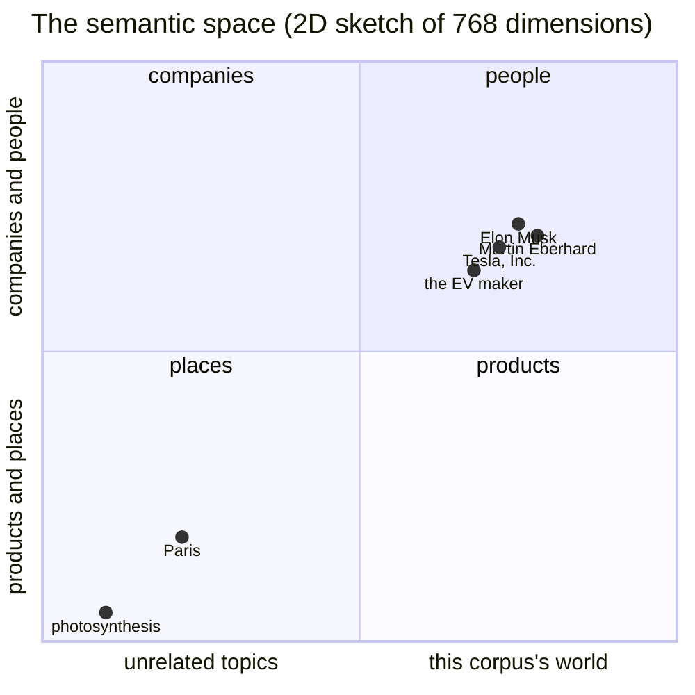

The crucial theoretical properties:

1. **Meaning becomes geometry.** "Do these mean the same thing?" becomes
   "how close are these points?" — computable with multiplication and
   addition.
2. **It generalizes lexically.** `"the EV maker"` and `"Tesla"` share
   *zero characters* yet land close, because training taught the model that
   electric-vehicle-maker *refers* to Tesla. No rule listed that; the
   geometry absorbed it.
3. **It is graded, not binary.** Similarity is a continuous spectrum, not a
   yes/no.

---

## Part 2 — The core dichotomy: geometry vs. topology

This is the theoretical heart of why you'd add embeddings *to a graph
system* rather than instead of it.

| | Embeddings (geometry) | Graph (topology) |
|---|---|---|
| answers | "what is **near** what?" | "what **connects** to what?" |
| the fact's structure | none — relation is destroyed, folded into closeness | explicit — `CEO_OF` is a typed, directed edge |
| matching | soft, graded, symmetric | hard, exact, asymmetric |
| promise | high **recall** — something relevant is always retrievable | high **precision** — if a path exists within k hops, it's in the evidence |
| failure | right *neighborhood*, wrong *relationship* | nothing, if the link was never extracted/merged |

The one-line theory:

> **Similarity ≠ relation.** `"Tesla"` and `"Elon Musk"` have high cosine
> similarity — but their *meaning* is the edge
> `Elon Musk --CEO_OF--> Tesla`, which no vector contains. Conversely,
> `"the EV maker"` has no edge to Tesla in our graph — no string overlap to
> walk. **Geometry is where the graph is blind; topology is where vectors
> are blind.**

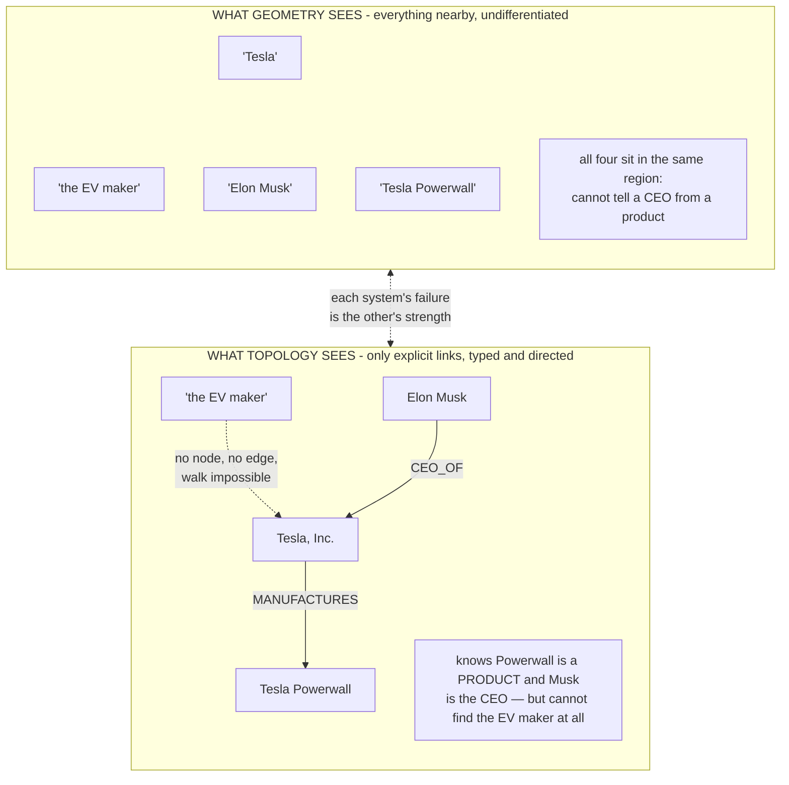

That symmetry of blindness is the entire case for hybrid: **in embedding
space, Musk ≈ Tesla ≈ Powerwall** (same domain — vectors *cannot tell a CEO
from a product*). **In the graph, "the EV maker" doesn't exist.**

---

## Part 3 — The five insertion points in this pipeline

Where, precisely, embeddings improve *this* system — ordered by payoff.

### 3.1 Entity linking at query time — the biggest win

Current theory (architecture.md, Part 6): the question must be turned into
**starting points**, and linking is name-based: exact → normalized →
substring. It works for `"Tesla"` → `tesla` but fails for:

- *"How is **the EV maker** funded?"* — no lexical overlap
- *"Who leads **the company Musk founded**?"* — paraphrase
- *"What happened after **the chip act**?"* — abbreviation/synonym

With embeddings, linking becomes **nearest-neighbor search**:

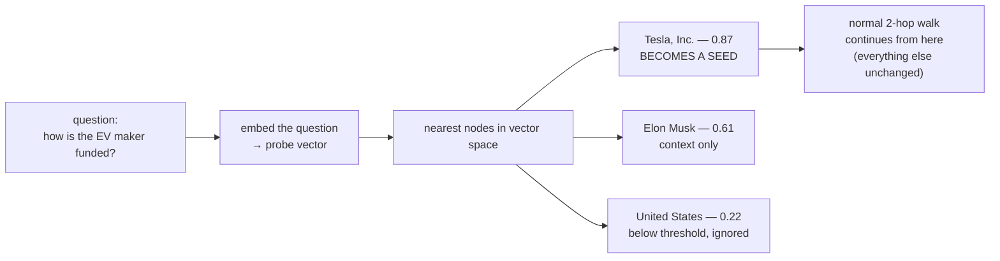

Theoretically this **replaces a discrete lookup with a continuous one**.
Only the *entry door* widens — the walk, the evidence, the citations are
all unchanged. That matters disproportionately because linking is a
**single point of failure**: when linking finds no seed, the whole local
search dies before it starts, *silently* — the exact "silent traversal
death" failure mode from architecture.md Part 4.

### 3.2 Entity resolution — embeddings as Level 3 of the ladder

Recall the merge funnel: **blocking → fuzzy (Jaro-Winkler) → LLM decides**.
Fuzzy matching is *character-based*, so:

| pair | Jaro-Winkler | verdict needed |
|---|---|---|
| `musk` vs `elon musk` | 0.53 — **below threshold, never nominated** | should merge |
| `tesla` vs `tesla motors` | 0.73 | should merge |
| `tesla` vs `tesla powerwall` | 0.72 | must NOT merge |

Embeddings at the nomination stage fix the first row: `musk` and
`elon musk` sit in the same vector region regardless of string length, so
cosine ≥ threshold **nominates** the pair for the LLM batch.

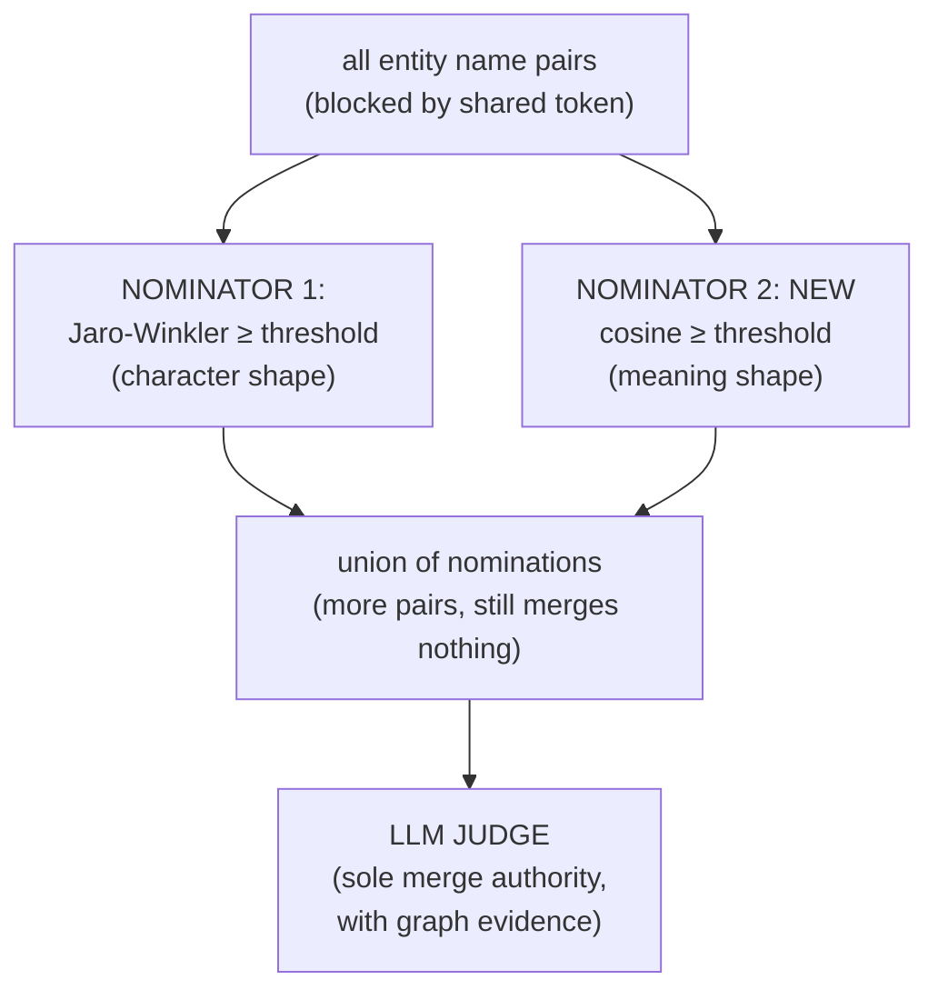

**But the deeper lesson is a warning:** the 0.73 paradox *repeats itself in
geometry*. `tesla powerwall` is *also* very close to `tesla` in vector
space — arguably closer than `tesla motors` is! Both are short,
Tesla-adjacent strings; vectors have no reliable notion of *product-of* vs
*former-name-of*. So:

> **Embeddings raise recall of nominations; they cannot raise precision of
> decisions.** The architecture rule survives untouched: *cheap layers
> nominate, expensive layers decide.* Embeddings join fuzzy matching as a
> nominator — the LLM remains sole judge, and the maker→made guardrail
> still protects products.

### 3.3 Vector fallback — fixing the no-seed failure

Today, no linked seed → *"try global mode"*. That's a real hole: the
question may be perfectly answerable from the text, just not from the
*graph*. The fallback chain becomes:

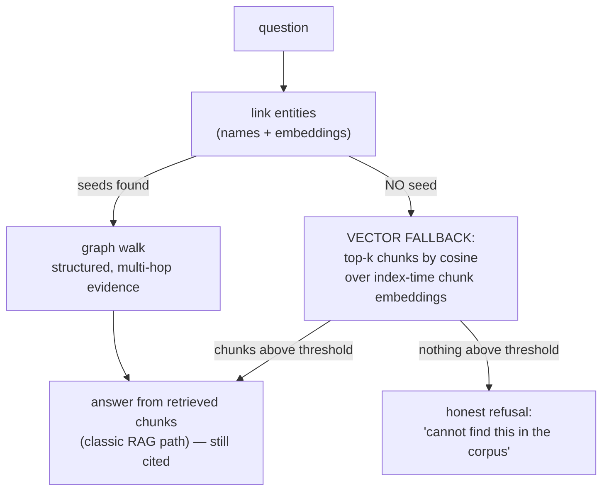

Theoretically this makes the system **total** — every question gets *some*
retrieval path instead of falling off a cliff. The cost: the fallback path
has only geometry (no structure), so its answers are single-paragraph RAG
answers — no multi-hop reasoning, but still cited. Degraded, not broken.

### 3.4 Evidence ranking — smarter context selection

After the walk we currently rank evidence by two heuristics:
touches-a-seed first, then mention count — both *proxies* for relevance to
the question. An embedding is the direct measure: rank every candidate
fact/chunk in the subgraph by cosine(question, fact text), keep top-N for
the prompt.

The full explanation of why this matters deserves its own section — see
below.

### 3.5 (Optional, use with care) Semantic edges

One could add `SIMILAR_TO` edges between nodes with cosine ≥ 0.9 — letting
geometry *become* topology. The theory says **be careful**:

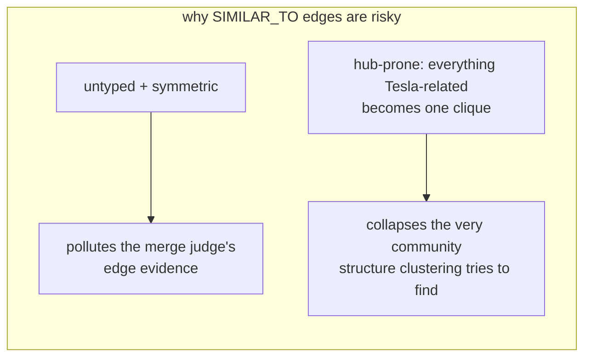

The cleaner design keeps geometry as a **separate index the query layer
consults**, and topology pure: **embeddings guide the walk; they don't
rewrite the map.**

---

## 3.4 in full — Evidence ranking, explained simply

### The problem: the walk grabs too much

When you ask *"Who is the CEO of Tesla?"*, local search doesn't just grab
one edge. It walks **2 hops out** from Tesla and grabs **everything** it
touches:

```
Walk from Tesla, Inc. (2 hops) picks up:

  ✅ Elon Musk --CEO_OF--> Tesla          ← what you need
  ❌ Tesla --LOCATED_IN--> United States
  ❌ Tesla --ACQUIRED--> SolarCity
  ❌ Tesla --COMPETES_WITH--> BYD
  ❌ Tesla --MANUFACTURES--> Model 3
  ❌ Eberhard --FOUNDED_BY--> Tesla
  ❌ Panasonic --SUPPLIES--> Tesla
  ... and hundreds more on the full graph
```

All of it goes into the LLM's prompt as "evidence." But most of it has
**nothing to do with the question**.

### Why that's bad: the LLM gets distracted

LLMs have a known weakness called **"lost in the middle"**:

> When you give a model a huge prompt, it reads the **start** and the
> **end** carefully — but facts buried in the **middle** get ignored or
> forgotten.

So if the CEO fact lands at position 47 out of 100 facts, the model may
literally *not see it* — and answer wrong, even though the right fact was
sitting right there in the prompt.

**The problem isn't finding the fact. The problem is the fact drowning in
noise.**

### What we do now (the weak way)

| heuristic | logic | flaw |
|---|---|---|
| touches a seed? → put first | facts directly about Tesla are probably relevant | "probably" — Tesla's *location* also touches Tesla |
| mention count → higher first | popular facts are probably important | popular ≠ relevant. `LOCATED_IN` has 5 mentions and is still useless for a CEO question |

These are **proxies** — guessing relevance from indirect signals because
we can't measure it directly.

### What embeddings do (the direct way)

```
turn the question into a vector:      "Who is the CEO of Tesla?"
turn each fact into a vector:         "Elon Musk --CEO_OF--> Tesla"
                                      "Tesla --LOCATED_IN--> United States"
                                      ...

compare angles:
  cosine(question, "Elon Musk --CEO_OF--> Tesla")        = 0.91  🏆
  cosine(question, "Eberhard --FOUNDED_BY--> Tesla")     = 0.74
  cosine(question, "Tesla --LOCATED_IN--> US")           = 0.31
  cosine(question, "Tesla --COMPETES_WITH--> BYD")       = 0.28
```

The question *"who is the CEO"* is **semantically close** to the CEO fact
and **far** from the location fact — the vector math sees that, even though
both facts "touch Tesla" equally. Then: **sort by score, keep the top ~15,
throw the rest away.**

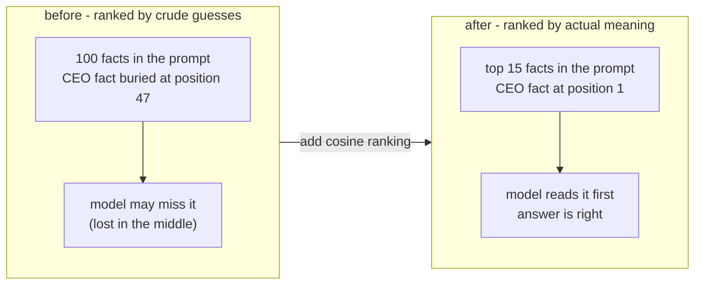

### The one-line version

> **The walk decides *what exists* in the evidence; embedding ranking
> decides *what's worth reading*.** It's a bouncer at the door of the
> prompt — hundreds of facts show up, only the ones that actually match the
> question's *meaning* get in, so the LLM never has to hunt through noise
> to find the answer.

Same pattern as everything else in this project: the graph guarantees the
fact is *retrievable*, embeddings make sure it's *visible*.

---

## Part 4 — The hybrid architecture, box by box

The full v2 query architecture, in the exact order a question flows through
it — what each box does, why it exists, what it costs, and how it can fail.

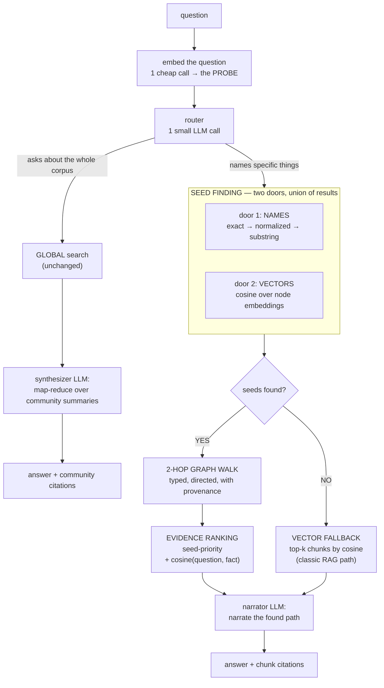

### Stage 0 — The question enters

Everything downstream depends on understanding the question string. The
first two boxes happen **before any routing decision** — and the order
matters.

**Box 1: Embed the question (1 cheap call).** The question is sent to the
embedding endpoint once, producing a vector — the **probe**. Why first?
Because this single vector is reused by *three* later stages:

| consumer | uses the probe for |
|---|---|
| seed finding (door 2) | matching question → graph nodes |
| evidence ranking | scoring question → facts |
| vector fallback | matching question → chunks |

Embed it once, pass it down. Embedding inside each stage would pay 3 calls
and risk inconsistency. Cost: ~50ms, effectively free.

**Key theory point:** the probe is the *only* geometry object created at
query time — everything it gets compared against (nodes, chunks) was
embedded once at index time.

**Box 2: Router (1 small LLM call).** Classifies the question's *shape*:

| question | shape | route |
|---|---|---|
| "Who is the CEO of the EV maker?" | names/implies specific things | **LOCAL** |
| "What are the main themes in this dataset?" | asks about the whole corpus | **GLOBAL** |

Why route at all? The two modes have opposite economics: local is cheap
and precise but needs a starting point; global is thorough but reads
pre-written summaries and can't do multi-hop. Sending every question to
both would double cost and muddy answers.

**Failure handling:** if the router call fails, default to **local** — the
cheaper, more precise mode. Fail toward the safe option.

### Stage 1 (LOCAL) — Seed finding: two doors, union of results

The heart of the upgrade. The question must become **starting nodes** in
the graph. v1 had one door; now there are two, and we take the **union** of
what each finds.

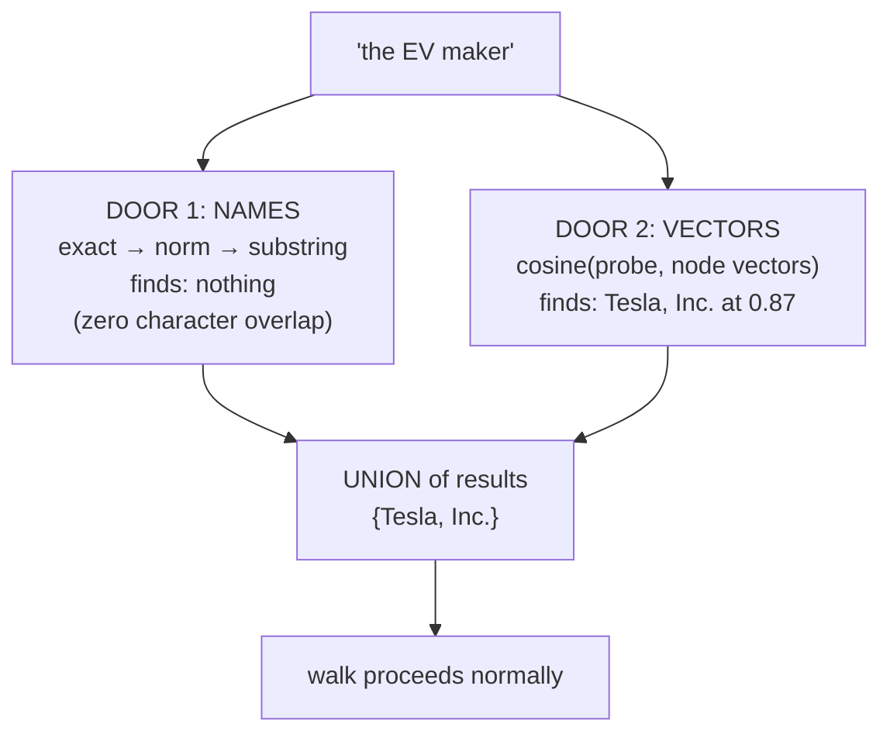

**Door 1 — name matching (what v1 already does).** A cascade of
ever-looser string rules. Free, instant, and *precise* — when it fires,
the node is almost certainly right. Blind spot: requires character
overlap.

**Door 2 — vector matching (the new door).** Cosine similarity between the
probe and every node's pre-computed embedding. A threshold decides which
nodes qualify. Blind spot: vectors can't tell *why* something is close —
"Tesla Powerwall" also scores high on "the EV maker". Geometry is
promiscuous.

**Why the union, not either alone:**

| scenario | door 1 | door 2 | union result |
|---|---|---|---|
| "Tesla" | ✅ exact | ✅ close | Tesla (agreement = confidence) |
| "the EV maker" | ❌ | ✅ | Tesla (vectors rescue) |
| "Musk" | ✅ substring | ✅ | Elon Musk |
| made-up name "Blorptonic" | ❌ | ❌ | **empty → triggers fallback** |

Two doors cover each other's blindness: **doors are for recall, agreement
is for confidence.**

### Stage 2 (LOCAL) — The fork: seeds found or not?

This fork is the **totality guarantee** — the property v1 lacked. In v1,
"no seed" meant the search *died silently* and returned nothing. Now every
question has somewhere to go.

### Stage 3a (LOCAL, seeds found) — The 2-hop graph walk

Unchanged from v1 — deliberately. From each seed, follow edges two hops in
both directions:

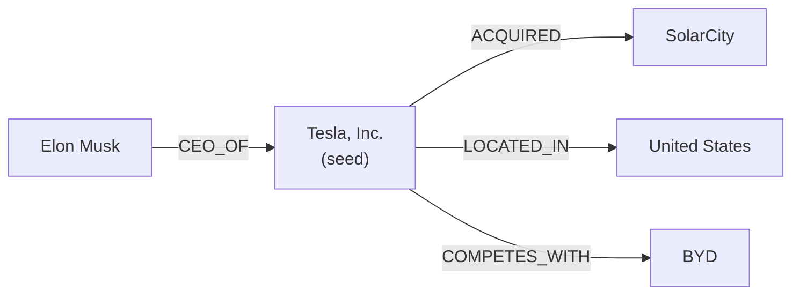

Three properties make the walk special (all preserved):

1. **Typed & directed** — the walk knows `CEO_OF` is different from
   `LOCATED_IN`. Geometry never had this.
2. **The guarantee** — *if a connection exists within 2 hops, it's in the
   evidence.* No similarity search can promise this; structure can.
3. **Provenance** — every edge remembers its source chunks. Citations
   survive the walk.

Cost: free (pure pointer-chasing). The walk collects the subgraph of facts
*plus* the original chunk texts behind them.

### Stage 4a — Evidence ranking: seed-priority + cosine

The walk hands back *hundreds* of facts on the full graph. Most are noise
for this question. Two-stage ranking:

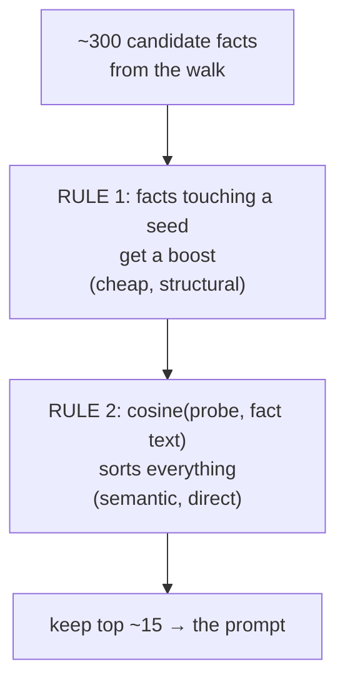

- **Seed-priority** is the structural prior: facts directly about what the
  question named matter more than facts two hops out.
- **Cosine** is the semantic sort: among everything, keep what *means*
  what the question asks. "Who is the CEO" pulls `CEO_OF` facts up and
  pushes `LOCATED_IN` down — even though both touch the seed equally.

This is the anti-"lost in the middle" step: the right fact enters the
prompt at position 1, not position 47. The division of labor: **the walk
decided *what exists*, embeddings decide *what's worth reading*.**

### Stage 3b (LOCAL, no seeds) — The vector fallback

This is **vanilla RAG living inside the GraphRAG** as a safety net. Theory
of when it's the *right* tool: the answer exists in a single paragraph but
the graph never extracted it (or extraction/merging broke the path).

**What it gives up:** no multi-hop reasoning (chunks aren't connected), no
structural guarantee. **What it keeps:** citations, because chunks still
carry provenance.

**Honest refusal stays:** if even vector search finds nothing, say so.
Never fabricate.

### Stage 5 (LOCAL) — The narrator

The final LLM call gets a *pre-digested* bundle: top-ranked facts + their
source chunks + the question. Its instruction: *narrate the connection that
was found, cite the chunks, refuse if the evidence doesn't contain the
answer.*

**Theory of the shrinkage:** in v1 RAG, the model's hardest job was
*finding* the connection. Here that job is done by the walk; the model only
narrates. Smaller job → smaller model suffices → fewer hallucinations,
because there's nothing left to invent.

### Stage GLOBAL — unchanged, and why it stays unchanged

Global search reads community summaries (written once at index time) via
map-reduce:

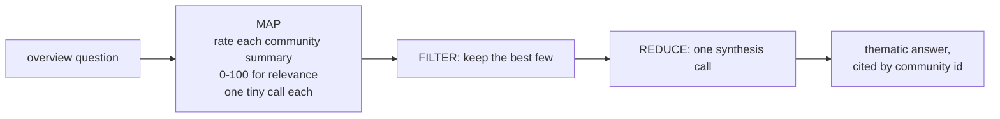

**Why embeddings don't touch this:** the whole point of communities was to
pre-compress the corpus *without* needing per-question similarity search —
the map step already does a smarter version of "which stored text is
relevant?" using the LLM itself. At ~50 communities, cosine over summaries
would save milliseconds on a path that already works. **Embeddings go
where the pain is (linking, ranking, fallback), not everywhere a vector
could technically fit.**

### Stage FINAL — two endings, one contract

| | LOCAL | GLOBAL |
|---|---|---|
| LLM's verb | *narrate* a found path | *synthesize* across summaries |
| evidence | facts + original chunks | community summaries |
| citations | chunk ids (`Tesla_Inc::9`) | community ids (`C0`, `C2`) |
| answers best | "how are X and Y connected?" | "what are the themes?" |
| guarantee | structural (k-hop completeness) | coverage (every topic was considered) |

Both endings share the same contract: **every claim traceable to something
on disk.**

### The three design principles the diagram encodes

1. **Fallbacks, not cliffs.** Router fails → default local. Door 1 fails →
   door 2. Both fail → vector fallback. Even that fails → honest refusal.
   No path ends in silence.

2. **Free layers narrow, paid layers decide, geometry ranks.** Names +
   walk + counts are free and handle structure. The LLM decides only what
   needs judgment. Embeddings do the one thing neither can: *graded
   meaning-matching*. Nothing does another's job.

3. **Index time pays, query time reads.** New index-time work = embedding
   47 nodes + ~2,000 chunks once into `vectors.json`. Query time adds
   exactly **one** embedding call (the probe) + a cosine scan that's
   milliseconds in plain Python. The cost shape of the system doesn't
   change — same "pay once, derive free forever" pattern as the checkpoint
   and the community summaries.

---

## Part 4b — What exactly gets embedded (the inventory)

| what | count now | why |
|---|---|---|
| **node names + type + aliases** | 47 | query→seed matching (§3.1) |
| **chunk texts** | ~2,027 | fallback retrieval + evidence ranking (§3.3, §3.4) |
| **question** | 1/query | the probe vector everything is scored against |
| *(optional)* candidate name pairs | generated at merge time | merge nominations (§3.2) |

One subtle theory point — **short-name noise**: embedding bare `"tesla"`
is unreliable (car? energy? numbat?). The standard remedy is a
**contextualized description**:

```
bare name (bad):        "tesla"
                        → ambiguous geometry, sits between every Tesla thing

described (good):       "Tesla, Inc. — ORGANIZATION — 81 mentions —
                         aliases: Tesla, Tesla Motors, Inc."
                        → sharp point in company-space, away from products
```

Same for facts: embed the rendered triple
(`"Elon Musk --CEO_OF--> Tesla, Inc."`), not isolated tokens — the
relation word is what keeps Musk-vectors from collapsing into
Tesla-vectors.

---

## Part 5 — Honest limits (what embeddings will NOT fix)

1. **They add no knowledge.** Embeddings rearrange what's already there —
   they retrieve, they don't reason. Every answer still comes from your
   chunks or your graph.
2. **Relation-confusion is inherent.** Vectors place CEO, competitor, and
   product side by side (Part 2). Any decision needing *relation types*
   must go through the graph.
3. **The merge paradox relocates, it doesn't vanish** (§3.2):
   `tesla` ≈ `tesla powerwall` in vector space too. Embeddings widen the
   funnel's mouth; the LLM judge still closes it.
4. **Threshold choice = the same precision/recall trade-off** you already
   met with Jaro-Winkler's 0.5. New numbers, identical dilemma — there is
   no threshold-free world.
5. **Freshness coupling.** When the graph rebuilds, vectors rebuild with
   it — but both derive from the checkpoint, so it's the same free
   re-derivation pattern you already have.
6. **It doesn't rescue broken structure.** Semantic seeds walking into a
   fragmented graph hit the same broken paths. Merging and edge validation
   remain prior obligations.

---

## Part 6 — The summary

> An embedding maps text to a point in space so that **meaning becomes
> distance** — giving a graded, lexical-free matching mechanism, exactly
> what the graph's hardest single point of failure needs, because graph
> linking is exact-string and dies silently on paraphrases. Adding
> embeddings yields three upgrades: **a second door into the graph**
> (semantic seed-finding + a vector fallback when no seed exists), **a
> better nominator** for the merge funnel (recall up, decisions still the
> LLM's), and **direct question-to-evidence ranking** at prompt time. But
> geometry can't express `CEO_OF`, can't tell a product from a former
> name, and guarantees no connection — so the architecture stays hybrid by
> theory, not fashion: **vectors for recall, graph for structure, LLM for
> narration**, each answering only the question it can actually keep its
> promise on.

---

*Continue with [architecture.md](architecture.md) for the full system, or
[solution.md](solution.md) for the entity-merging story.*
