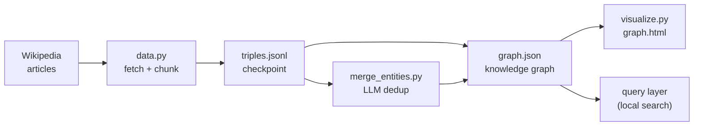
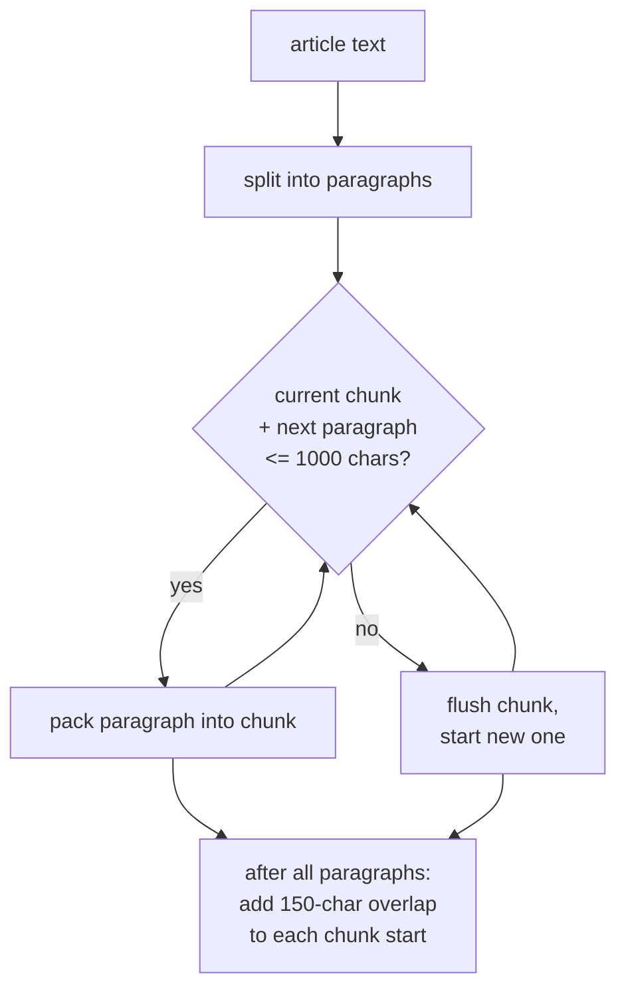
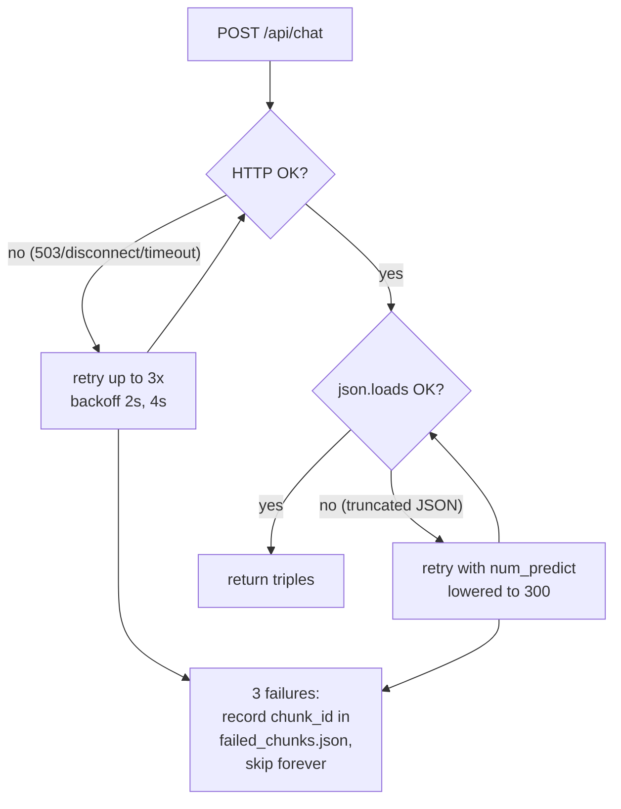
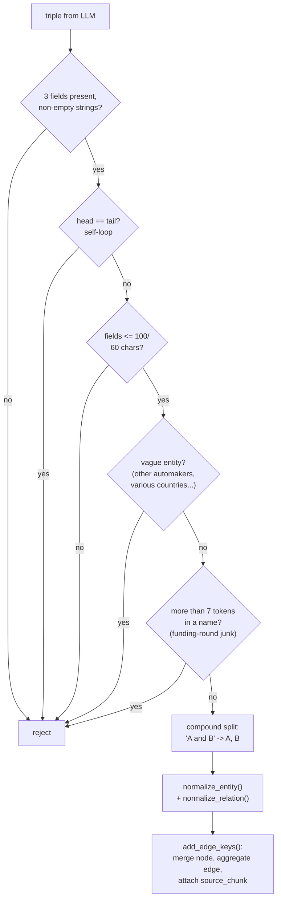
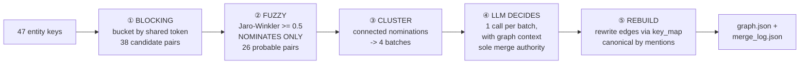

# Graph Making — Structure & Logic

How this project builds a knowledge graph from raw text, stage by stage.
This document explains the **what** and **why** of every stage, with real
examples from the actual data.

> Companion doc: **[solution.md](./solution.md)** covers the entity-merging
> problem in depth (how we made `Tesla, Inc.`, `Tesla` and `Tesla Motors, Inc.`
> become one entity).

---

## 1. The big picture

We are building a small **GraphRAG** pipeline. Vanilla RAG stores *what the
text says* (chunks + embeddings); GraphRAG additionally stores *how the facts
connect* (entities + relationships). That structure is what lets the system
answer multi-hop questions like *"How is OpenAI connected to Microsoft?"*
where no single document contains the answer.



The current files and their roles:

| File | Role |
|---|---|
| `data.py` | fetches 49 business/economy Wikipedia articles, cleans and chunks them |
| `test_llm.py` | 4-point health check of the Ollama endpoint (server, generation, JSON mode, chat) |
| `graph.py` | the `Graph` class: normalization, validation, merging, persistence |
| `build_graph.py` | the extraction pipeline: chunk → LLM → validate → merge → checkpoint |
| `merge_entities.py` | LLM-decided entity resolution (blocking → fuzzy → LLM) |
| `visualize.py` | renders the graph as an interactive HTML page (zoom/pan/drag) |

---

## 2. Stage 1 — Data acquisition (`data.py`)

### What it does

1. Fetches each article's **plain-text extract** from the Wikipedia API
   (`action=query&prop=extracts&explaintext=1`) — no API key needed.
2. **Cleans** the text: section headers lose their `====` decorations,
   excess newlines are collapsed.
3. Saves one `.txt` file per article under `data/articles/` and writes
   `data/index.json` (title, char count, chunk count, preview).

The article list is curated for *relationship richness* — companies, CEOs,
deals, regulators, countries — because a graph is only as good as the
connections inside it. Examples: `Tesla, Inc.`, `Elon Musk`, `Microsoft`,
`OpenAI`, `CHIPS and Science Act`, `United States–China trade war`, `OPEC`,
`Saudi Aramco`, `Berkshire Hathaway`, `TSMC`, `Foxconn` ...

Result: **50 articles, ~1.6M characters** of real business text.

### Why truncation

Articles are capped at 40,000 characters. The goal is *breadth across many
related entities*, not depth on a single article. A 200k-char article would
produce 200 chunks of extraction cost for one topic; 50 truncated articles
produce a cross-connected web of topics instead.

---

## 3. Stage 2 — Chunking

### The logic

Real GraphRAG systems chunk documents into ~300–800 token windows. Our
`chunk_text()` in `data.py` does a paragraph-aware version:



Key design decisions:

- **Paragraph packing** — never cut a paragraph in half if it fits; huge
  paragraphs are split at sentence boundaries (`. `) as a fallback.
- **150-char overlap** — each chunk starts with the tail of the previous
  one. If a fact is stated at a chunk boundary, both chunks see it. This
  is cheap insurance against boundary-lost facts.
- **Provenance from birth** — every chunk gets an ID like
  `Tesla_Inc::7` (file + index). Every triple extracted from it will carry
  this ID forever, which is what makes final answers citable.

Scale: 50 articles → **~1,200 chunks** (the extraction workload).

---

## 4. Stage 3 — LLM extraction (`build_graph.py`)

This is the only stage that talks to an LLM, and it is the heart of
GraphRAG indexing: turning prose into structured triples.

### The prompt

Each chunk is sent to `llama3.1:8b` / `qwen2.5:3b-instruct` on a remote
Ollama server (tunneled via ngrok) with:

```
SYSTEM: You are a precise entity and relationship extraction engine.
        You respond with ONLY valid JSON, no commentary.

USER:   Extract entities and relationships from the text below.

        Rules:
        1. Entity names: use the most complete form ("Tesla, Inc.", ...)
        2. Relations: UPPER_SNAKE_CASE (CEO_OF, FOUNDED_BY, LOCATED_IN,
           PARTNER_WITH, ACQUIRED, SUBSIDIARY_OF, COMPETES_WITH, ...)
        3. Extract ONLY facts explicitly stated in the text. Never invent.
        4. Entity types: PERSON, ORGANIZATION, LOCATION, PRODUCT, EVENT, MISC.
        5. Max 20 triples. Skip trivial facts.

        Return exactly this JSON shape:
        {"entities": [{"name": "...", "type": "PERSON"}],
         "triples": [{"head": "...", "relation": "...", "tail": "..."}]}

        TEXT:
        <<<chunk>>>
```

### Call settings that matter

| Setting | Value | Why |
|---|---|---|
| `format` | `"json"` | Ollama's structured-output mode guarantees parseable JSON |
| `temperature` | `0` | extraction is a *lookup* task — same input must give same output |
| `num_ctx` | 4096 | chunk + prompt + JSON overhead must fit |
| `num_predict` | 600 | caps output length → caps latency and prevents runaway lists |

### Example (real output from our smoke test)

Input chunk (`Tesla, Inc.` article, chunk 1):

> *"...Musk took an active role within the company and oversaw... Series B
> venture capital funding round of $13 million in February 2005..."*

Extracted triples:

```json
{"head": "Elon Musk", "relation": "CEO_OF", "tail": "Tesla, Inc."}
{"head": "Tesla, Inc.", "relation": "LOCATED_IN", "tail": "United States"}
{"head": "Tesla, Inc.", "relation": "COMPETES_WITH", "tail": "other automakers"}
```

Quality reality check: a 3B model produces good triples *and* noise
(`COMPETES_WITH → "other automakers"` is vague; some triples come out
inverted). Everything downstream exists to handle exactly this.

### Robustness: retries, salvage, permanent failure

The tunnel (ngrok → remote Ollama) is flaky, so `extract_chunk()` has three
layers of defense:



---

## 5. Stage 4 — Checkpointing (`triples.jsonl`)

Every chunk's extraction result is **appended** to `data/triples.jsonl`
(one JSON object per line) *before* the graph is updated:

```json
{"chunk_id": "Tesla_Inc::1", "doc": "Tesla, Inc.",
 "triples": [{"head": "Elon Musk", "relation": "CEO_OF", "tail": "Tesla, Inc."}],
 "entities": [{"name": "Elon Musk", "type": "PERSON"}]}
```

Why this file is the most important artifact in the project:

1. **Crash safety** — a full run is ~1,200 LLM calls over 1–2 hours.
   Interrupt it at minute 80 and a restart skips every chunk already
   present (`done` set) and continues where it left off.
2. **Free re-processing** — the graph is *derived* from this checkpoint.
   Better merging logic? Delete `graph.json`, re-run the merge, and the
   whole graph rebuilds in seconds with **zero LLM calls**.
3. **Auditability** — every triple in the graph can be traced to the exact
   chunk (and therefore the exact source sentence) that produced it.

Failed chunks are logged to `failed_chunks.json` so one stubborn chunk
(the model produced broken JSON on it 3 times) doesn't block the run.

---

## 6. Stage 5 — Graph construction (`graph.py`)

### Data model

A property graph stored as two dicts:

```python
nodes[key] = {"display": "Tesla, Inc.", "type": "ORGANIZATION",
              "mentions": 81, "aliases": {"Tesla", "Tesla Motors, Inc.", ...}}

edges[(head_key, RELATION, tail_key)] = {
    "head": "tesla", "relation": "CEO_OF", "tail": "elon musk",
    "mentions": 5, "source_chunks": ["Tesla_Inc::1", "Tesla_Inc::4", ...]}
```

### The gate: validation pipeline per triple

Every triple an LLM produces passes through `add_triple()`, which is a
*defensive gate* — the LLM's output is treated as a suggestion, not data:



### Normalization (entity resolution levels 0+1)

`normalize_entity()` builds the canonical **merge key** from any mention:

```
"Tesla, Inc."   → lowercase → strip punctuation → drop stop-words
                → strip corporate suffixes (inc, corp, ltd, plc, gmbh, ...)
                → "tesla"
"Tesla Inc"     → "tesla"          (same key → auto-merged)
"tesla, INC."   → "tesla"          (same key → auto-merged)
"Elon Musk"     → "elon musk"      (different key → different node)
```

Two important subtleties:

- The suffix whitelist is **conservative**: it strips `inc/corp/ltd/...`
  but *not* `motors`, `group`, `energy` — those words carry meaning
  ("General Motors", "Volkswagen Group", "Tesla Energy" are real names).
- The **merge key** is stripped, but the **display name** keeps the full
  form. We merge on `tesla` while still displaying "Tesla, Inc.".

`normalize_relation()` does the same for edge labels: `"is CEO of"` →
`CEO_OF`.

### Edge aggregation & the mentions count

When 5 different chunks all say `Elon Musk → CEO_OF → Tesla, Inc.`, the
graph does **not** store 5 edges. It stores one edge with `mentions: 5`
and a list of all 5 source chunks.

The mention count is a free confidence score:

- real relationships get re-extracted from every article discussing them
  → high mentions
- hallucinated/inverted junk tends to appear once → `mentions: 1`
- pruning rule for later: *drop edges with `mentions == 1`* and the graph
  cleans itself

Same for nodes: `Tesla, Inc.` has `mentions: 81` because 81 node-slots
across the graph point at it.

### Persistence

`Graph.save()` writes `data/graph.json` (nodes + edges), `Graph.load()`
reads it back. Saved artifacts:

```
data/
├── articles/          49 .txt files (raw source text)
├── index.json         article metadata
├── triples.jsonl      extraction checkpoint (the gold artifact)
├── failed_chunks.json permanently-failed chunk IDs
├── graph.json         the current knowledge graph
├── merge_log.json     entity-merge audit log
└── graph.html         interactive visualization
```

---

## 7. Stage 6 — Entity merging (summary here, details in solution.md)

After the raw graph exists, `merge_entities.py` runs the LLM-decided
dedup pass:



The fundamental rule: **fuzzy matching only nominates — the LLM is the
sole merging authority.** See [solution.md](./solution.md) for the full
story of why, including the three failure modes we hit and fixed live.

---

## 8. Stage 7 — Visualization (`visualize.py`)

Generates a self-contained `graph.html` (no Python packages; vis-network
loaded from CDN in the browser):

- **mouse wheel** = zoom, **drag canvas** = pan, **drag node** = rearrange
- hover any node/edge = tooltip (type, mentions, aliases, source chunks)
- node **size** = mention count, edge **thickness** = mentions
- colors by entity type (PERSON orange, ORGANIZATION blue, LOCATION green,
  PRODUCT purple, EVENT red, MISC gray)
- filters: `--min-mentions 2` (drop one-off junk), `--max-nodes 300`
  (keep best-connected)

```bash
python visualize.py                 # render everything
python visualize.py --min-mentions 2
```

---

## 9. What we're building toward

Once the full ~1,200-chunk run completes and the merge pass cleans it:

1. **`query_graph.py`** — local search: link a question entity to a node,
   walk k hops, pull source chunks, and give the LLM (triples + chunks) to
   compose a cited answer.
2. **Communities + global search** — Louvain/Leiden clustering and LLM
   community summaries for dataset-wide questions.
3. **Hybrid retrieval** — vectors for semantic recall + graph for structure.

The pipeline is deliberately staged so every expensive step is checkpointed
and every cheap step is re-runnable — the extraction cost is paid once,
and everything downstream can be rebuilt, tuned, and fixed for free.
