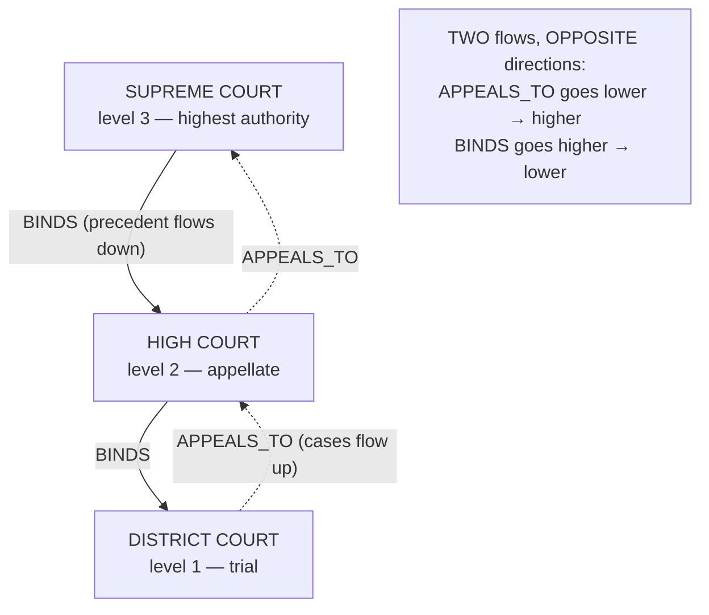
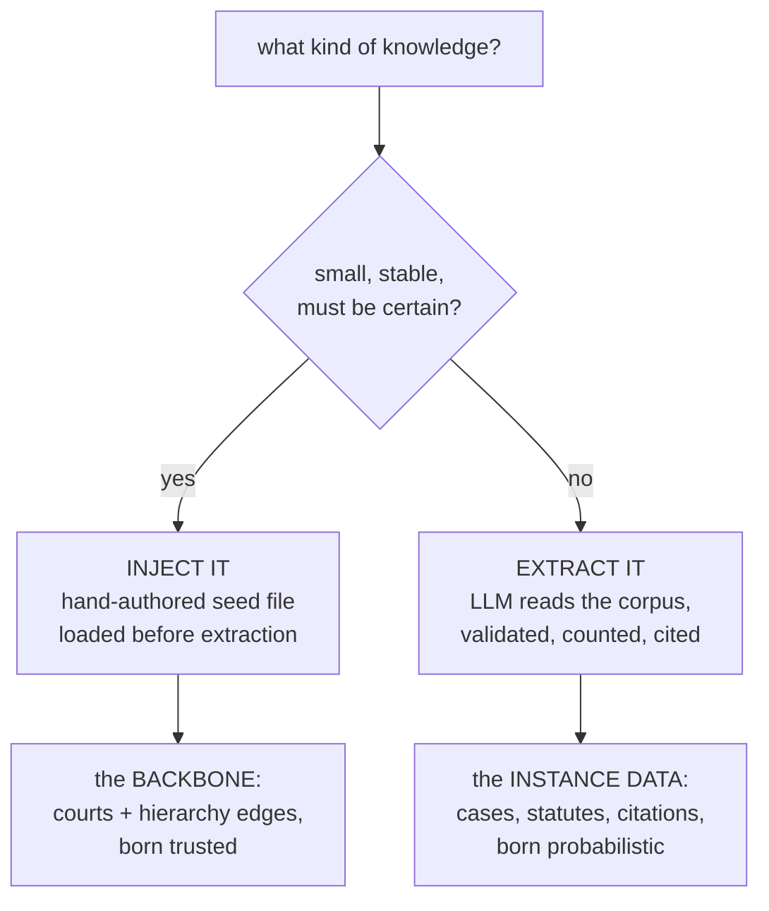
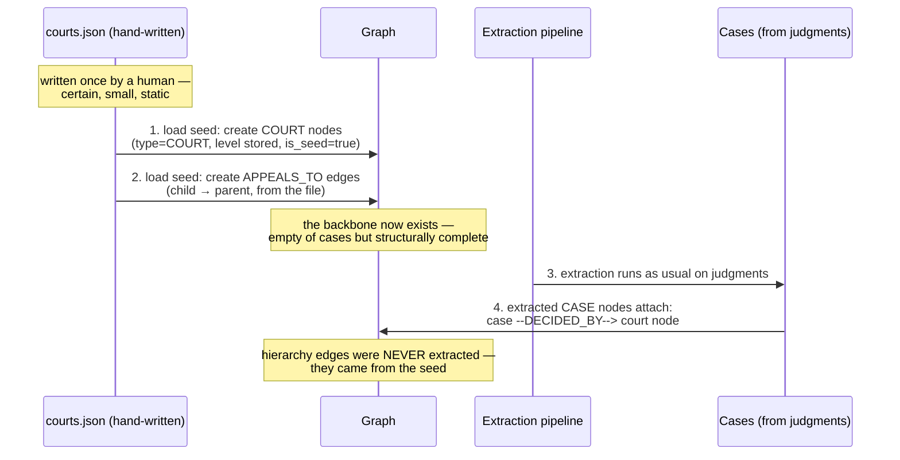
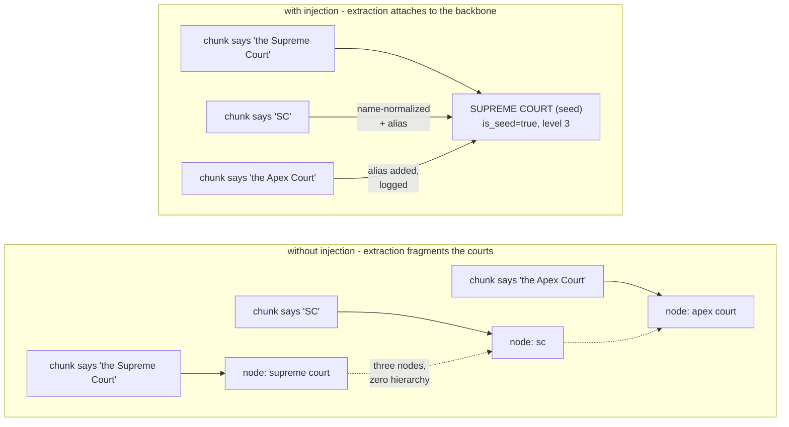
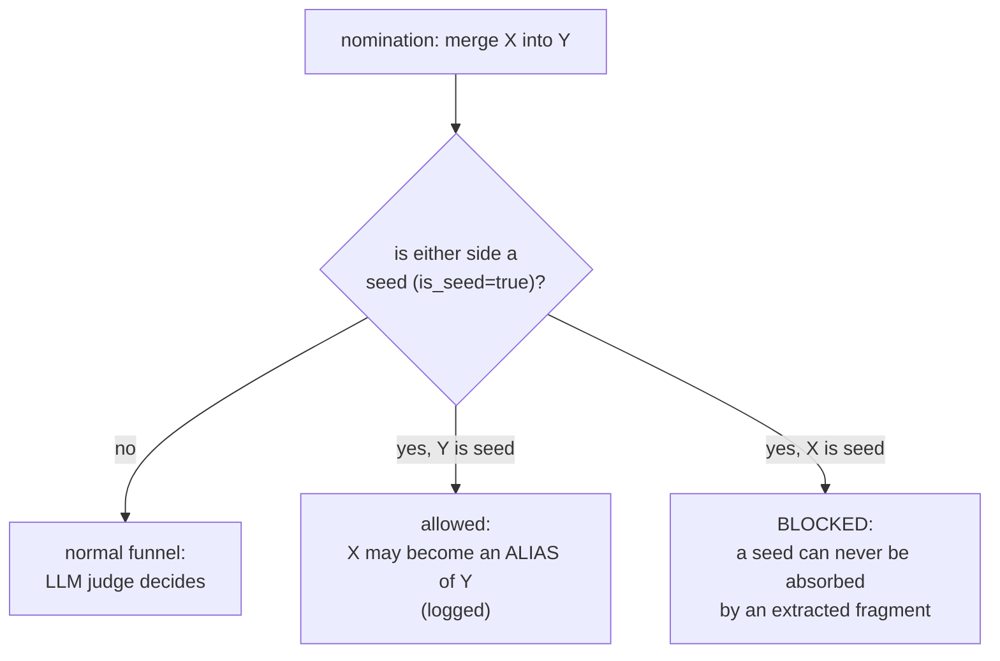
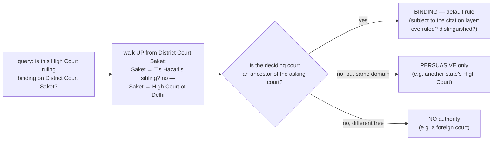
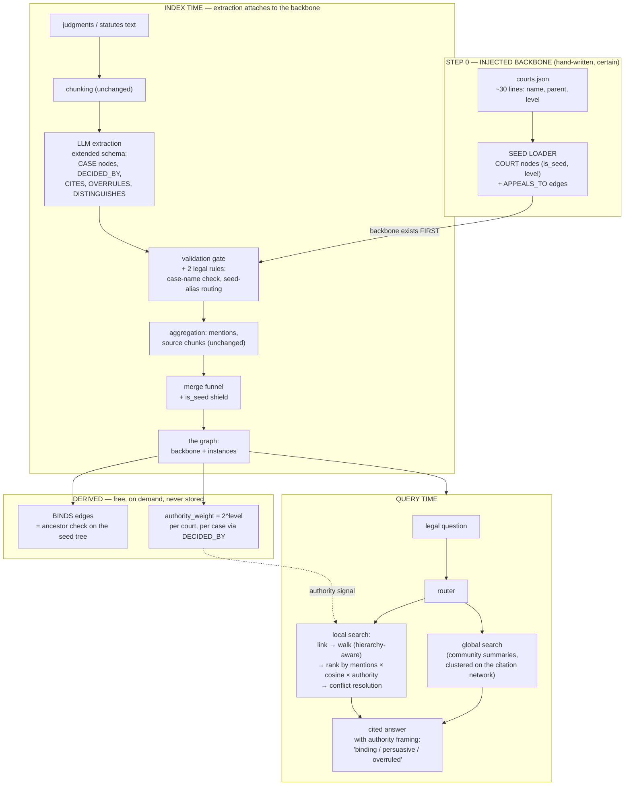

# Legal RAG — Injecting the Authority Hierarchy

How to build a RAG that answers **legal questions**, where the central design
problem is *authority*: not all sources are equal, and "who said it" matters
as much as "what was said."

The main focus of this document is the **injection of the court hierarchy**
— a piece of knowledge that is too important, too small, and too stable to
be discovered by an LLM, and therefore must be **seeded into the graph by
hand**. The full architecture appears at the end, once the mechanism is
clear.

> Written for a reader who has read [architecture.md](architecture.md) or
> [embed_research.md](embed_research.md): same style — theory first, diagrams
> throughout, real design decisions explained.

**The idea in one line:** a legal RAG is a normal knowledge-graph RAG plus
one extra ingredient — a **hand-authored hierarchy of authority** that is
*injected* into the graph as a trusted backbone, before any extraction runs.

## Contents

| Part | Topic |
|---|---|
| 1 | Why authority changes everything |
| 2 | The mental unlock: hierarchy = typed, directed edges |
| 3 | Extract or inject? The decision that defines this design |
| 4 | The seed file — what exactly gets injected |
| 5 | The injection mechanism, step by step |
| 6 | Protecting the backbone (merge funnel + validation gate) |
| 7 | What the hierarchy buys: binding-ness computed, not stored |
| 8 | Pitfalls and honest limits |
| 9 | The full legal-RAG architecture |

---

## Part 1 — Why authority changes everything

In the business-corpus RAG, every fact was equal. If two chunks disagreed,
the disagreement itself was interesting. **In law, disagreement is the
norm** — and the system that resolves it is not "the bigger context wins"
but **the higher court wins**.

Consider what a naive RAG does with two conflicting retrievals:

```
naive RAG, asked: "Is X legal?"

retrieved chunk A:  "The Delhi High Court held X illegal (2019)"
retrieved chunk B:  "The Supreme Court upheld X as legal (2021)"

naive answer:  "Some sources say illegal, others say legal"   ← useless, dangerous
legal answer:  "X is legal. The Supreme Court's 2021 ruling is binding on
                all courts; the 2019 Delhi High Court ruling no longer
                stands on this point. [cite A] [cite B]"
```

The only difference between the two answers is **knowledge of the
hierarchy**. That knowledge must live *inside the graph* so the query layer
can rank, filter, and reason with it.

Three properties of legal questions drive the whole design:

| property | consequence for the graph |
|---|---|
| Sources have rank (SC > HC > District) | nodes must carry **authority level**; evidence must be **ranked by it** |
| Precedent flows downward | the hierarchy must be **directed**, not symmetric |
| Precedent can be overturned | the hierarchy is *potential* authority; the citation layer is *actual* authority |

---

## Part 2 — The mental unlock: hierarchy = typed, directed edges

The graph you already have has no concept of "parent" or "child" nodes —
and it needs none. A hierarchy is nothing exotic. It is just **nodes
connected by typed, directed edges**:

```
Supreme Court --SUPERIOR_TO--> High Court of Delhi --SUPERIOR_TO--> District Court Saket
```

"Child node" = "node that has a `SUPERIOR_TO` edge pointing at it from
above." The tree *emerges* from the edges; nothing in the storage format
changes.



Two flows, **opposite directions** — the single most important design
decision in this document:

| edge | direction | meaning |
|---|---|---|
| `APPEALS_TO` | lower → higher | where a case *goes* |
| `BINDS` / `SUPERIOR_TO` | higher → lower | whose precedent *controls* whom |

Pick both, and derive one from the other: *A binds B ⟺ B appeals (transitively) to A.*
Never collapse them into one vague `RELATED` edge — **direction is the
entire content of a hierarchy**. An undirected "is part of the judiciary"
edge supports zero legal reasoning.

Also note what the hierarchy is *not*: it is **a forest, not one tree**.
Federal and state systems run in parallel and must not touch — a federal
district court is *not bound* by a state appellate court (though it may be
*persuaded* by it, which is why `PERSUADES` exists as a real, weaker edge
in legal reasoning). The seed file simply declares multiple roots; the
graph does not care.

---

## Part 3 — Extract or inject? The decision that defines this design

Every other node in the existing pipeline is born one way: an LLM reads
text and proposes it. The court hierarchy must break that rule. Here is the
reasoning, stated as a decision table:

| question | extraction (LLM reads text) | injection (hand-authored seed) |
|---|---|---|
| Is the knowledge stable? | no — the model may describe the same court three ways | **yes — the hierarchy is static for years** |
| Is it small? | n/a | **yes — dozens of nodes, not thousands** |
| Is it certain? | no — LLMs are never 100% | **must be — one wrong hierarchy edge poisons every "is this binding?" answer** |
| Cost to obtain | one LLM pass over the whole corpus, repeated whenever text changes | **~30 lines of JSON, written once** |

Extraction is for *instance data*: many, messy, corpus-specific facts. The
hierarchy is the opposite on every axis — few, clean, corpus-independent,
and required to be correct. **You do not pay an LLM to discover what you
already know.**



This gives the system a clean division of labor — the same philosophy as
the merge funnel ("cheap layers nominate, expensive layers decide"), one
level up:

| layer | who builds it | reliability |
|---|---|---|
| **Backbone** — courts, hierarchy | hand-authored seed | certain |
| **Instance data** — cases, citations, statutes | LLM extraction | probabilistic → validated |

Deterministic structure injected; the LLM only fills in instances.

---

## Part 4 — The seed file: what exactly gets injected

The hierarchy lives in one small, hand-written file — the *only* hand-written
data in the entire pipeline:

```jsonc
// data/courts.json — the authority backbone (hand-authored)
[
  { "name": "Supreme Court",          "parent": null,                   "level": 3 },
  { "name": "High Court of Delhi",    "parent": "Supreme Court",        "level": 2 },
  { "name": "District Court Saket",   "parent": "High Court of Delhi",  "level": 1 },
  { "name": "District Court Tis Hazari", "parent": "High Court of Delhi", "level": 1 },
  { "name": "State High Court X",     "parent": "Supreme Court",        "level": 2 }
  // ... one entry per court; ~30 lines total
]
```

Each entry says three things:

| field | meaning |
|---|---|
| `name` | the canonical display name — also the node's merge-protected identity |
| `parent` | the court directly above it (null = a root of its own tree) |
| `level` | the authority rank, used as a *numeric* signal later (ranking, conflict resolution) |

Three design choices inside the file are worth stating:

1. **`level` is stored explicitly** even though it is derivable from the
   tree depth. Redundant on purpose: ranking code should not have to walk
   the tree to sort evidence, and an explicit number makes "which court is
   higher" a comparison, not a traversal.
2. **The file is the single source of truth for the hierarchy.** If the
   graph shows a hierarchy edge, it came from this file — no exceptions.
   That makes every hierarchy edge auditable ("which hand-written line
   caused this?") and every later disagreement diagnosable.
3. **Multiple roots are legal.** Federal tree, state trees, tribunal trees —
   each is a separate `parent: null` entry. The graph stores a forest and
   never invents connections between trees.

---

## Part 5 — The injection mechanism, step by step

The seed file is loaded at **index time, before extraction**. This ordering
is the whole trick: the backbone exists *first*, and everything the LLM
extracts afterwards **attaches to it**.



Step by step, what the loader does:

1. **Create the COURT nodes.** Each entry becomes a node with
   `type=COURT`, the stored `level`, and a flag `is_seed=true`.
2. **Create the hierarchy edges.** Each `parent` link becomes a directed
   `APPEALS_TO` edge (child → parent). The `BINDS` edges (higher → lower)
   are **not stored at all** — they are derived on demand (Part 7).
3. **Mark the nodes as protected.** `is_seed=true` is read by two other
   components: the merge funnel (Part 6) and the validation gate.
4. **Then, and only then, extraction begins.** The LLM reads judgments and
   produces CASE nodes with `DECIDED_BY` edges pointing at court names —
   which now resolve to *existing seed nodes* instead of creating
   fragments.

The last point deserves a diagram of its own, because it is the practical
payoff of injecting first:



Without the seed, court names arrive as *new* nodes from a model with
amnesia — fragmented, untyped, hierarchy-less (the exact
"Tesla/Tesla Motors" problem, but worse: **there is no merge funnel signal
that can reconstruct a hierarchy**). With the seed, court mentions resolve
against known canonical nodes and merely enrich them — aliases, mention
counts, source chunks.

### The injection rule, generalized

What happened to courts generalizes to any domain with *certain, small,
stable* structure:

| domain | injectable backbone | what extraction attaches to it |
|---|---|---|
| legal | courts + hierarchy | cases, statutes, citations |
| corporate | org chart, subsidiaries | employees, deals, products |
| medical | anatomy / drug classes | studies, trials, interactions |
| product | product catalog tree | reviews, incidents, parts |

> **Rule: the certain skeleton is injected; the uncertain flesh is
> extracted.** The skeleton is small enough to be right by construction;
> the flesh is too big to be written by hand.

---

## Part 6 — Protecting the backbone

Injecting trusted nodes creates a new obligation: **nothing downstream may
silently damage them.** Two existing components need one new rule each.

### 6.1 The merge funnel gets a shield

Seed nodes are **canonical by fiat** — the hand-written file defines what
the real court is called. So:

- a fuzzy or vector nomination may **never propose merging a seed node
  into a non-seed node** (the reverse is fine: a non-seed fragment may be
  merged *into* a seed, and that is exactly how "the Apex Court" becomes
  an alias);
- any nomination touching a seed is still **audited** like every other
  merge decision — logged, with the reason "seed node: canonical by
  injection."



### 6.2 The validation gate gets legal-specific rules

The extraction gate already filters vague and malformed output; the legal
domain adds two cheap checks:

| new gate rule | kills |
|---|---|
| a proposed `CASE` head/tail must look like a case name (contains a `v.` / `vs.`) | judgments being turned into person/org entities |
| an entity matching a seed court name is rejected as a *new node* and routed as an alias/mention instead | duplicate "Supreme Court" nodes being born post-injection |

Both rules are free, deterministic, and protect the exact invariant
injection creates: **one court, one node, forever.**

---

## Part 7 — What the hierarchy buys: binding-ness computed, not stored

The deepest payoff of injecting the tree is that the most important legal
question — *whose precedent controls whom?* — stops being data and becomes
**a computation on the tree**.

> **A binds B ⟺ A is an ancestor of B in the seed tree.**



Three properties of this design:

1. **Binding-ness is never extracted, never stored, never hallucinated.**
   It is recomputed from the tree on demand — always correct *relative to
   the seed file*, and auditable to a hand-written line.
2. **The hierarchy gives potential authority; the citation layer gives
   actual authority.** A 1995 Supreme Court case *binds* everyone — until
   an `OVERRULES` edge (extracted) says it was overruled in 2020. Tree =
   the rank order; citations = whether the precedent is still good law.
   Both layers are needed, and they answer different questions.
3. **Authority becomes a ranking signal.** Evidence scoring gains a third
   term (joining mention-count and cosine from embed_research.md §3.4):

```
evidence_score = f(mentions, cosine(question, fact), authority_weight)

authority_weight:  Supreme Court = 8,  High Court = 4,  District = 2
                   (i.e. 2^level — cheap, monotonic, tunable)
```

When two extracted facts **conflict**, the answer is framed by the higher
authority — the legal-domain version of the mention-count confidence
signal, and exactly how a lawyer reads: *binding beats persuasive, higher
beats lower, recent overrules old.*

### The three query powers the hierarchy enables

| power | example question | mechanism |
|---|---|---|
| **Path queries** | "Is a High Court ruling binding on Saket?" | ancestor check on the seed tree + overrule check on the citation layer |
| **Scope queries** | "What has the Supreme Court said about privacy?" | seed node acts as a hub: gather all `DECIDED_BY → SC` cases, rank, cite |
| **Conflict resolution** | "Is X legal?" (with conflicting rulings) | rank the conflicting evidence by authority; frame the answer with the winner, cite the loser as history |

---

## Part 8 — Pitfalls and honest limits

| pitfall | why it happens | defence |
|---|---|---|
| **Hierarchy ≠ case law** | the tree is static; precedent is dynamic | tree = *potential* authority; `CITES`/`OVERRULES` layer = *actual* good law |
| **Binding ≠ always followed** | courts distinguish unfavorable precedent constantly | model `DISTINGUISHES` as a first-class edge or answers overstate certainty |
| **Merging court with case** | "Supreme Court" (institution) and "the 2017 privacy ruling" (event) are different things | node types + the gate's case-name rule |
| **Unprotected seeds** | fuzzy matching happily merges "Supreme Court" into junk | the `is_seed` shield (Part 6), audited |
| **Hub swallowing in communities** | one Supreme Court with `BINDS` edges to forty courts drags everything into one blob | exclude hierarchy edges from clustering — cluster on the citation network (more meaningful anyway) |
| **Stale seed file** | judiciary reorganized, file not updated | the file is versioned like code; hierarchy changes are a diff, not a re-extraction |

The meta-lesson is the same one that shaped the merge funnel: **a
probabilistic component must never be the sole source of a deterministic
fact.** The hierarchy is deterministic; therefore it is not extracted.

---

## Part 9 — The full legal-RAG architecture

With the injection mechanism understood, the whole system fits in one
diagram. Note how small the *new* parts are: one seed file, one loader
step, two gate rules, one derived edge, one ranking term.



Reading the diagram, layer by layer:

| layer | new or reused | what it contributes |
|---|---|---|
| **Seed file + loader** | NEW — the heart of this doc | the certain backbone: courts, `APPEALS_TO`, levels, `is_seed` protection |
| **Chunking → extraction → gate → aggregation** | reused, extended | CASE/statute nodes attach to the backbone; two cheap gate rules protect it |
| **Merge funnel** | reused, + shield | fragments may become aliases of seeds; seeds are never absorbed |
| **Derived layer** | NEW — free | `BINDS` from ancestry; authority weights from levels |
| **Query layer** | reused, authority-aware | ranking gains the authority term; answers gain *binding/persuasive/overruled* framing |

And the whole idea in three sentences:

1. **Inject** the court hierarchy by hand before extraction — certain,
   small, static knowledge is never discovered by an LLM.
2. **Attach** extracted cases and citations to that backbone, protected by
   an `is_seed` shield and two legal gate rules.
3. **Compute** binding-ness from tree ancestry instead of storing it, and
   rank evidence by `mentions × cosine × authority` — so the system reads
   conflicting sources the way a lawyer does: *binding beats persuasive,
   higher beats lower, recent overrules old.*

---

*See [architecture.md](architecture.md) for the base pipeline this extends,
[embed_research.md](embed_research.md) for the ranking signals (mentions,
cosine) that authority joins, and [solution.md](solution.md) for why merge
protection matters.*
