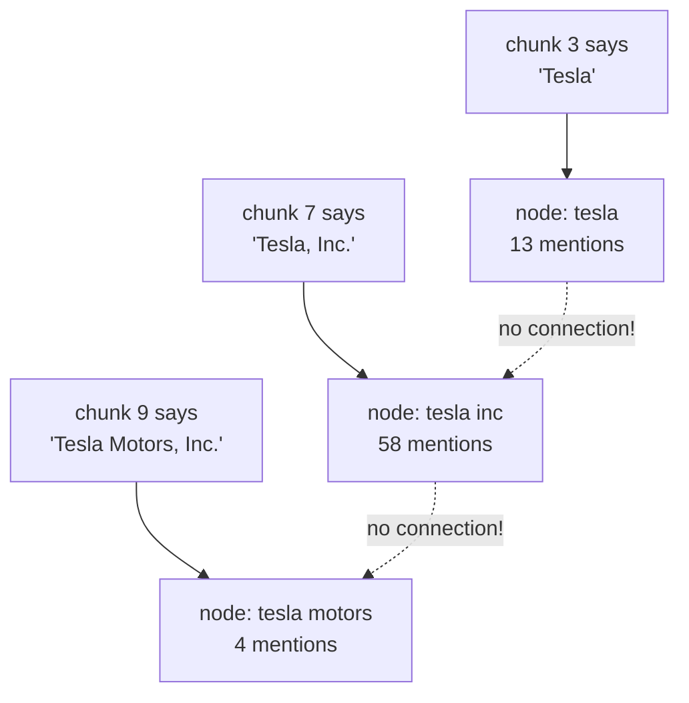
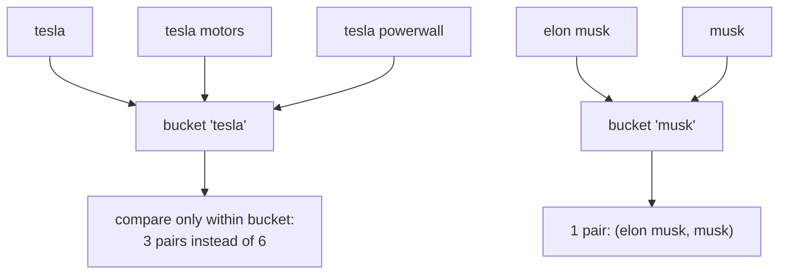
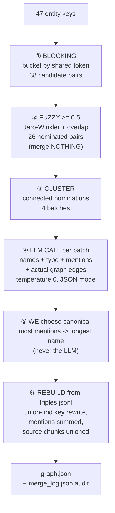

# Solution — How We Solved Entity Merging (The "Tesla Problem")

The story of one specific, real problem in our GraphRAG pipeline:
the LLM extracted **three nodes for one company** — and how we fixed it
with a layered, auditable, LLM-decided entity-resolution pass.

> Companion doc: **[graph_making.md](./graph_making.md)** covers the full
> pipeline (fetch → chunk → extract → graph).

---

## 1. The problem

After extracting just 14 chunks (the Tesla article), the graph contained:

```
Tesla, Inc.        (58 mentions)
Tesla              (13 mentions)
Tesla Motors, Inc. (3 mentions)      ← Tesla's legal name before 2017
```

Three nodes. One company. This is **entity fragmentation**, and it is the
classic disease of LLM-built knowledge graphs:



Why it's fatal for GraphRAG specifically:

- **Split evidence** — "Tesla, Inc." looks 4× more important than "Tesla
  Motors, Inc." even though they're the same thing; ranking and pruning
  silently misjudge everything.
- **Broken traversal** — a 2-hop walk starting at node `tesla` never sees
  edges stored under `tesla inc` or `tesla motors`. Multi-hop paths *die
  silently at the gap*. This is the worst kind of bug: no error, just
  missing answers.
- **Garbage communities** — later, when we cluster the graph into
  communities, the same company appears as three "topics".

And a subtler trap: **naive merging is worse than no merging.** `"Tesla
Powerwall"` and `"Tesla Model 3"` are *different entities* that also
contain the string "Tesla". The problem is not "merge similar strings" —
it's "decide what refers to the same real-world thing."

---

## 2. The tool ladder (and where each level failed for us)

| Level | Technique | What it caught | Where it failed |
|---|---|---|---|
| 0 | Normalization (lowercase, strip punctuation) | `Tesla, Inc.` ≡ `tesla inc` | can't touch `tesla motors` |
| 1 | Corporate-suffix whitelist (`inc, corp, ltd...`) | `Tesla, Inc.` + `Tesla` → **one node** ✅ | nothing for `motors` (deliberately — see §3) |
| 2 | Fuzzy matching (Jaro-Winkler + token overlap) | nominated `tesla ~ tesla motors` | couldn't *decide* safely (see §4) |
| 3 | Embedding similarity | (not needed in this project) | — |
| 4 | **LLM adjudication with graph context** | `tesla motors` → merged ✅, products → rejected ✅ | needed guardrails (see §6) |

The journey through levels 1 → 2 → 4 — including three live failures —
is the real story. Each failure taught a rule that survives in the final
code.

---

## 3. Level 1 — The suffix whitelist (first 50% free)

`normalize_entity()` strips a **whitelisted** set of trailing corporate
suffixes from the merge *key* only:

```
"Tesla, Inc."  → key "tesla"      "Tesla Inc" → key "tesla"
"Apple, Inc."  → key "apple"      "BP plc"    → key "bp"
```

Why a **whitelist** and not "strip any trailing word":

| Trailing word | Same company? | Verdict |
|---|---|---|
| `inc`, `corp`, `ltd`, `plc`, `gmbh`, `ag`, `llc` | yes — pure legal noise | strip ✅ |
| `motors` | **no** — "General Motors" ≠ "General" | keep ❌ |
| `group` | no — "Volkswagen Group" is a specific thing | keep |
| `energy` | no — "Tesla Energy" is a real division | keep |

Immediately after adding the whitelist: `Tesla, Inc.` absorbed `Tesla`
(58 mentions and climbing), but `Tesla Motors, Inc.` stayed separate.
String rules cannot know "Motors" here is noise ("the historical name")
while "General **Motors**" there is meaning. That requires *knowledge*.

---

## 4. Level 2 — Fuzzy matching nominates, but must not decide

`merge_entities.py` scores candidate pairs with a weighted combination:

```
score = 0.6 × Jaro-Winkler("tesla", "tesla motors")    = 0.6 × 0.883
      + 0.4 × token overlap {tesla} vs {tesla, motors} = 0.4 × 0.500
      = 0.73
```

The decision problem: our auto-merge threshold was 0.87, and 0.73 < 0.87 —
**blocked**. Lower the threshold to 0.7? Then the *products* also clear
it:

```
"tesla" vs "tesla powerwall"  →  ~0.72   ← must NOT merge
"tesla" vs "tesla energy"     →  0.73    ← must NOT merge (real division!)
"tesla" vs "tesla motors"     →  0.73    ← MUST merge
```

Three pairs, one score. **No string function can separate them** — the
difference between "Motors" (noise) and "Energy" (meaning) is world
knowledge, not character similarity. We tried rule-based guards on top:

- containment bonus (one name ⊂ the other) → over-merged `Tesla Model 3` ❌
- type checks → backfired: the 3B model types almost everything `MISC`,
  and our inferred types were poisoned by inverted triples (§ "Tesla
  Motors, PERSON") ❌
- product-veto edges (`MANUFACTURES`) → helped, but most product edges
  didn't exist in the sparse graph ❌

Conclusion: strings can **nominate** candidates cheaply, but the *merge
decision* needs judgment.

---

## 5. Blocking & buckets — making candidate search affordable

Before judging anything: how do we even find candidate pairs without
comparing all n·(n−1)/2 name pairs (2M comparisons at 2,000 nodes)?

**Blocking:** drop every name into buckets keyed by each of its tokens;
only compare names that share a bucket.



`"tesla motors"` joins both the `tesla` and `motors` buckets; `"Palo
Alto"` and `"Warren Buffett"` share no bucket and are never compared.
38 pairs instead of 1,081 for our 47-node graph — and buckets are capped
at 60 members so one popular token can't sneak the quadratic monster
back in.

The known trade-off: if two true duplicates share *no* token ("Musk" vs
"Elon"), they're never compared. Blocking buys speed with (a little)
recall — which is fine, because blocking only needs to catch the
*obvious* candidates; the hard cases come with context later.

---

## 6. Level 4 — The LLM as sole merge authority

Final architecture — **fuzzy nominates, LLM decides**:



### The prompt (the part that made it work)

The first version sent **names only** — and failed spectacularly (§7).
The working version sends **graph evidence** per entity:

```
Below are entities flagged as POSSIBLE duplicates of each other.
For each you get its name, type, mention count, and actual graph edges.

  "Tesla, Inc."        (type=ORGANIZATION, mentions=76) | edges:
      <- CEO_OF from Elon Musk; LOCATED_IN -> United States;
      ACQUIRED -> SolarCity
  "Tesla Motors, Inc." (type=MISC, mentions=4) | edges:
      FOUNDED_BY -> Martin Eberhard; FOUNDED_BY -> Marc Tarpenning
  "Tesla Powerwall"    (type=MISC, mentions=1) | edges:
      PARTNER_WITH -> Tesla, Inc.

Rules:
1. Merge legal-form variants, historical names ("Tesla Motors" is the
   former name of "Tesla, Inc"), unambiguous short forms.
2. Judge by the EDGES: a company HAS a CEO, locations, acquisitions;
   a PRODUCT is manufactured by a company. If one entity's edges point
   AT the other, they are DIFFERENT.
3. Different location names = different entities ("Gigafactory Texas"
   is NOT "Gigafactory Mexico").
4. If unsure, do NOT group. Missing a merge is a small error; a wrong
   merge is a big error.
5. Each entity in at most one group; best-known name first.

Return ONLY: {"groups": [["canonical", "variant", ...], ...]}
```

The evidence changes the task from "compare strings" to "reason about
the world with the graph as witness". A 3B model that previously merged
everything Tesla-shaped now reads `PARTNER_WITH → Tesla, Inc.` on
Powerwall and *sees* the product–company relationship.

### Guardrails around the LLM

Even with a good prompt, LLM output is **untrusted**:

- every returned name is checked against the batch (hallucinated names
  are dropped)
- a name claimed by two groups keeps only its first claim
- singleton groups are discarded
- **the canonical name is chosen by our code** (most mentions → longest
  name), never by the LLM — given the choice, the model picked "Eberhard"
  over "Martin Eberhard" and would have made the hub display as "Tesla
  Motors, Inc."
- temperature 0 (dedup must be deterministic)
- everything is written to `merge_log.json` before the graph is touched

### The rebuild

Merges are applied by re-reading `triples.jsonl` (no LLM calls), mapping
every key through `key_map`, and re-inserting via `add_edge_keys()`.
Mention counts fold together, source-chunk lists union, aliases merge —
the evidence is *added up*, not thrown away.

---

## 7. The three failures that shaped the final design

These are real runs, preserved because each one broke something.

### Failure 1 — names-only prompt: sycophantic merging

```
Batch: ['Tesla, Inc.', 'Tesla Motors, Inc.', 'Model S', 'Model X',
        'Tesla Powerwall', 'Tesla Powerpack', 'Tesla Energy', ...]

LLM verdict:  MERGE ALL OF THEM
```

The 3B model, shown similar-looking names and asked to group them,
grouped everything. Products, divisions, historical names — all folded
into one mega-node. **Lesson:** an LLM without context defaults to
"agree". Fix: graph evidence in the prompt + "if unsure, do NOT group".

### Failure 2 — same prompt, same model: the silent opposite

One run later (after guard changes), the *same* Tesla batch produced
**zero merges** — `tesla ~ tesla motors` was never even nominated
because type guards rejected it. Root cause discovered by inspecting
node types: our type-backfill had voted `tesla motors` = **PERSON**
because inverted triples like `(Martin Eberhard, FOUNDED_BY, Tesla
Motors)` made it look like a person. **Lessons:** (a) guard lists
interact with each other in surprising ways — check the whole chain;
(b) one-off edges are noise — the backfill now only lets edges with
`mentions >= 2` vote on types.

### Failure 3 — names-only again: the confident wrong merge

```
Batch: ['Gigafactory Texas', 'Gigafactory Mexico']
LLM verdict:  MERGE      ← different factories, different countries!
```

**Lesson:** structural similarity ("Gigafactory X") is exactly where
string-brained merging fails. Fix: prompt rule 3 ("different location
names = different entities") + the same graph-evidence context.

### Final run (names + type + mentions + edges)

| Batch | Verdict | Correct? |
|---|---|---|
| Tesla batch (9 names) | merge **only** `Tesla Motors, Inc.` | ✅ all 7 products untouched |
| `Martin Eberhard` + `Eberhard` | merge | ✅ |
| `California` + `Fremont, California` + NUMMI plant | merge | ⚠️ defensible, logged for review |
| `Gigafactory Texas` + `Gigafactory Mexico` | **no group** | ✅ correctly declined |

**4 LLM calls, ~4 seconds, zero API cost — with graph context doing the
heavy lifting.**

---

## 8. Result

```
BEFORE                          AFTER
Tesla, Inc.         (58)        Tesla, Inc.    (62) type=ORGANIZATION
Tesla               (13)          aliases: [Tesla, Tesla Motors, Inc.]
Tesla Motors, Inc.  (4)
— 3 nodes, split evidence       — 1 node, all evidence folded in
```

Verified edges on the merged hub:

```
elon musk  --[CEO_OF]-->      tesla   x5
tesla      --[LOCATED_IN]-->  united states  x5
tesla      --[ACQUIRED]-->    solarcity      x2
```

And the merges that were correctly *refused*:

```
Tesla Powerwall / Powerpack / Model S / Model X / Model 3 / Energy  ← independent
Gigafactory Texas ≠ Gigafactory Mexico                              ← independent
```

---

## 9. Principles worth keeping

1. **Over-merging is worse than under-merging.** Two fragments of Tesla
   cost some edge weight; one false merge poisons every future traversal.
   Every threshold and prompt rule is biased toward "don't merge".
2. **Cheap layers nominate, expensive layers decide.** Blocking and fuzzy
   matching are free and dumb — they find candidates. The LLM is smart
   and costs a call — it only judges candidates. Neither does the other's
   job.
3. **Give the judge evidence, not just names.** Types, mention counts and
   edges turned a sycophantic string-matcher into a reliable adjudicator.
4. **LLM answers yes/no; deterministic code owns the bookkeeping.**
   Canonical naming, mention folding, and chunk-unioning must be
   reproducible — never delegated to a probabilistic component.
5. **Audit everything.** `merge_log.json` records every nomination, every
   verdict, every skip. When a merge looks wrong you can find it, and
   because the graph rebuilds from `triples.jsonl` in seconds, you can
   fix the rules and re-merge for free.
6. **Unvalidated LLM output is a liability.** Every stage treats model
   output as a suggestion: validate, constrain, log, and only then apply.
